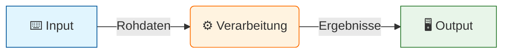
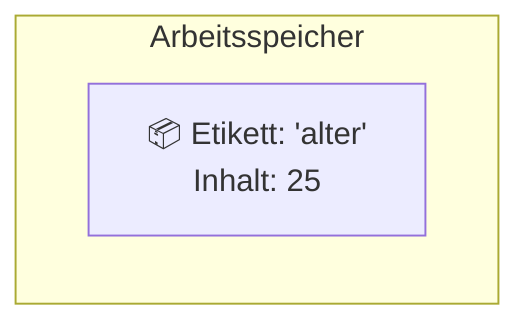
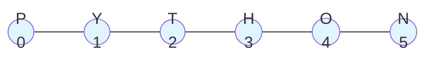
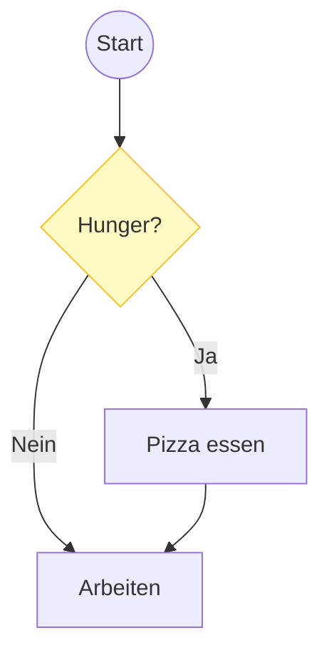
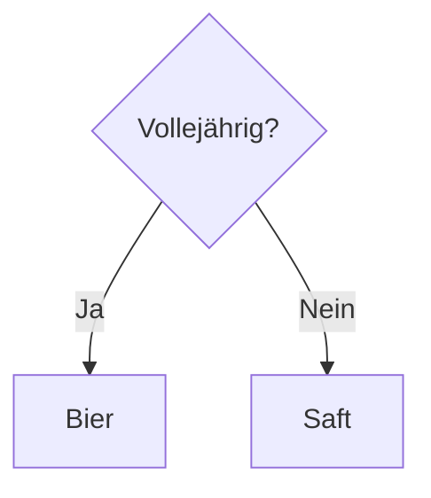
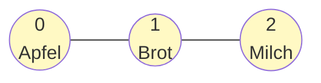
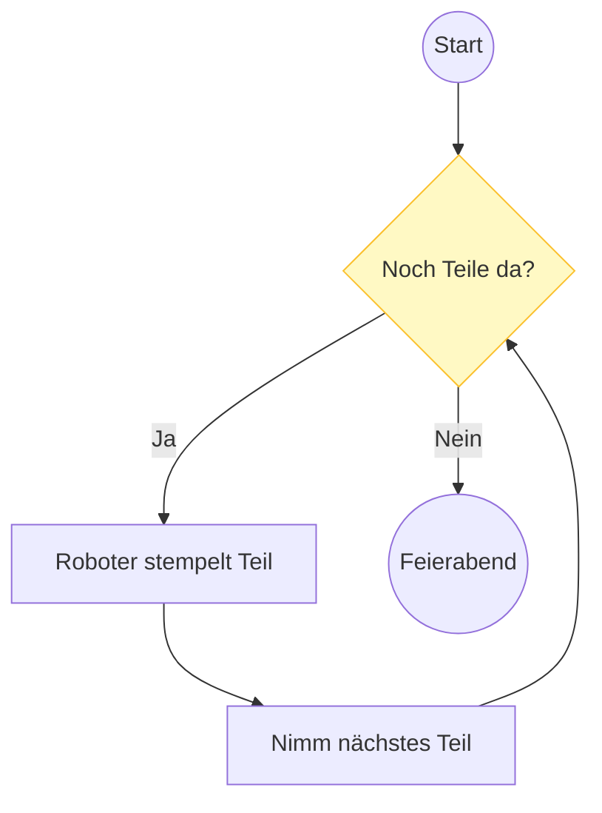
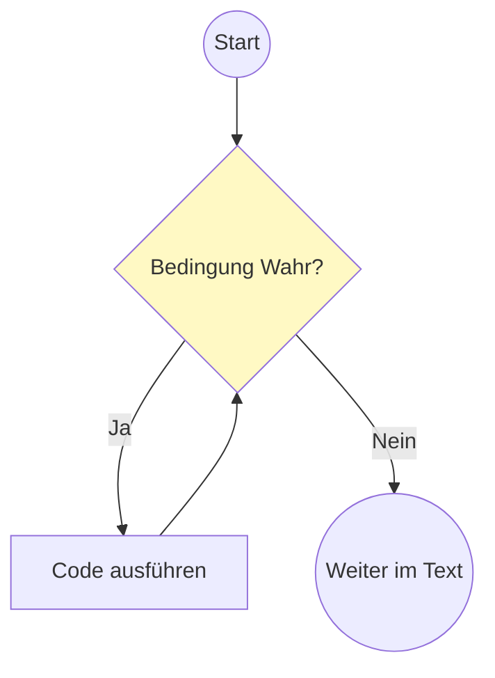
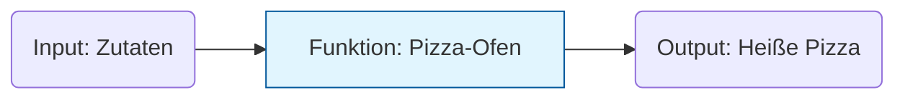

# 🐍 30-Tage Python Kurs - Woche 1: Grundlagen

## 📖 Über Woche 1

**Was du diese Woche lernst:**
Die absoluten Grundlagen von Python - das Fundament für alles Weitere!

**Themen:**
- ✅ Tag 1: Variablen, Datentypen, Operatoren
- ✅ Tag 2: Strings und String-Methoden
- ✅ Tag 3: If/Else Bedingungen
- ✅ Tag 4: Listen
- ✅ Tag 5: For-Schleifen
- ✅ Tag 6: While-Schleifen
- ✅ Tag 7: Funktionen

**Zeitaufwand:** 7 Tage × 5-15 Minuten = ca. 1-2 Stunden gesamt

---

## 📋 Überarbeiteter 30-Tage Kursplan

### 🌱 Woche 1: Grundlagen (Tag 1-7)
- Tag 1: Variablen & Operatoren - Taschenrechner
- Tag 2: Strings - Namensgenerator
- Tag 3: If/Else - Chatbot
- Tag 4: Listen - To-Do Liste
- Tag 5: For-Schleifen - Multiplikationstabelle
- Tag 6: While-Schleifen - Zahlenratespiel
- Tag 7: Funktionen - BMI-Rechner

### 🌿 Woche 2: Fortgeschrittene Basics (Tag 8-14)
- Tag 8: Dictionaries - Kontaktverwaltung
- Tag 9: List Comprehensions - Datenfilter
- Tag 10: Tuples & Sets - Duplikat-Entferner
- Tag 11: File I/O (lesen) - Textdatei-Analyzer
- Tag 12: File I/O (schreiben) & Error Handling - Notiz-App
- Tag 13: String-Formatierung & Regex Basics - E-Mail Validator
- Tag 14: Datetime - Geburtstags-Countdown

### 🌳 Woche 3: OOP & Praktische Tools (Tag 15-21)
- Tag 15: Klassen Grundlagen - Bankkonto-Klasse
- Tag 16: Klassen Methoden & Attribute - Kontaktbuch mit Klassen
- Tag 17: Vererbung (Inheritance) - Fahrzeug-Hierarchie
- Tag 18: os & pathlib - Ordner-Organizer
- Tag 19: shutil & glob - Datei-Backup-Tool
- Tag 20: json - Konfigurations-Manager
- Tag 21: csv - Ausgaben-Tracker

### 🚀 Woche 4: Fortgeschrittene Anwendungen (Tag 22-30)
- Tag 22: requests - Wetter-App (API)
- Tag 23: Web Scraping Basics - Preis-Monitor
- Tag 24: PIL/Pillow - Batch Bildbearbeitung
- Tag 25: zipfile & Archive - Automatischer Archiver
- Tag 26: sqlite3 Grundlagen - Einfache Datenbank
- Tag 27: sqlite3 mit OOP - Aufgaben-Manager
- Tag 28: argparse - CLI-Tool
- Tag 29: Mini-Projekt: Datei-Manager mit GUI (tkinter)
- Tag 30: Abschlussprojekt: Personal Library Manager (kombiniert alles)

---

# 📋 Überarbeiteter 30-Tage Kursplan

## 🌱 Woche 1: Grundlagen (Tag 1-7)
- **Tag 1:** Variablen & Operatoren - Taschenrechner
- **Tag 2:** Strings - Namensgenerator
- **Tag 3:** If/Else - Chatbot
- **Tag 4:** Listen - To-Do Liste
- **Tag 5:** For-Schleifen - Multiplikationstabelle
- **Tag 6:** While-Schleifen - Zahlenratespiel
- **Tag 7:** Funktionen - BMI-Rechner

## 🌿 Woche 2: Datenstrukturen & Dateien (Tag 8-14)
- **Tag 8:** Dictionaries - Kontaktverwaltung
- **Tag 9:** Tupel & Sets - Daten-Deduplizierung
- **Tag 10:** File I/O (lesen) - Textdatei-Analyzer
- **Tag 11:** File I/O (schreiben) - Notiz-App mit Speicherfunktion
- **Tag 12:** Error Handling (try/except) - Robuster Input-Handler
- **Tag 13:** List Comprehensions - Datenfilterung
- **Tag 14:** String-Formatierung & Datetime - Event-Reminder

## 🌳 Woche 3: OOP & Module (Tag 15-21)
- **Tag 15:** Classes Grundlagen - Bankkonto-System
- **Tag 16:** OOP (Methoden & Attribute) - Bibliotheksverwaltung
- **Tag 17:** OOP (Vererbung) - Fahrzeug-Hierarchie
- **Tag 18:** Module erstellen - Eigenes Utility-Modul
- **Tag 19:** os & pathlib - Datei-Organizer
- **Tag 20:** json & pickle - Daten speichern/laden
- **Tag 21:** random & statistics - Würfel-Simulator mit Statistik

## 🚀 Woche 4: Praktische Anwendungen (Tag 22-30)
- **Tag 22:** csv-Modul - Ausgaben-Tracker
- **Tag 23:** datetime & calendar - Kalender-App
- **Tag 24:** shutil & zipfile - Backup-Tool
- **Tag 25:** glob & regex (Basis) - Datei-Umbenenner
- **Tag 26:** argparse - CLI-Tool (Kommandozeilen-Args)
- **Tag 27:** requests - Wetter-API Client
- **Tag 28:** Projekt: Kontakt-Manager (alles kombiniert)
- **Tag 29:** Projekt: Datei-Sync-Tool
- **Tag 30:** Projekt: Quiz-App mit Highscores

---

**Verbesserungen am Plan:**
✅ Classes/OOP jetzt in Woche 3 (nicht am Ende)
✅ Gleichmäßigere Schwierigkeitskurve
✅ Mehr Fokus auf Grundlagen vor externen Libraries
✅ Praktische Projekte am Ende, die alles kombinieren
✅ Keine Web Scraping (zu komplex für Basis-Kurs)
✅ Keine GUI (kann in Aufbau-Kurs)

---

## 📅 ÜBERARBEITETER 30-TAGE KURSPLAN

### 🌱 Woche 1: Grundlagen (Tag 1-7)
- Tag 1: Variablen & Operatoren - Taschenrechner
- Tag 2: Strings - Namensgenerator
- Tag 3: If/Else - Chatbot
- Tag 4: Listen - To-Do Liste
- Tag 5: For-Schleifen - Multiplikationstabelle
- Tag 6: While-Schleifen - Zahlenratespiel
- Tag 7: Funktionen - BMI-Rechner

### 🌿 Woche 2: Datenstrukturen & Fehlerbehandlung (Tag 8-14)
- Tag 8: Dictionaries - Kontaktverwaltung
- Tag 9: List Comprehensions - Datenfilter
- Tag 10: Tupel & Sets - Lottozahlen-Generator
- Tag 11: File I/O (lesen) - Textanalyse
- Tag 12: File I/O (schreiben) - Tagebuch-App
- Tag 13: Error Handling - Robuster File-Reader
- Tag 14: **Classes (OOP Basics)** - Bankkonto-Klasse

### 🌳 Woche 3: OOP & Praktische Tools (Tag 15-21)
- Tag 15: **OOP Vertiefung** - Bibliotheks-System (Inheritance)
- Tag 16: **OOP Advanced** - RPG Charakter-System
- Tag 17: os & pathlib - Datei-Organizer
- Tag 18: shutil & glob - Massen-Umbenennung
- Tag 19: json - Konfigurations-Manager
- Tag 20: csv - Ausgaben-Tracker
- Tag 21: datetime - Event-Planer

### 🚀 Woche 4: Fortgeschrittene Anwendungen (Tag 22-30)
- Tag 22: random & collections - Passwort-Generator
- Tag 23: sqlite3 - Einfache Datenbank
- Tag 24: requests - Wetter-App (API)
- Tag 25: PIL/Pillow - Batch Bildbearbeitung
- Tag 26: zipfile - Backup-Tool
- Tag 27: argparse - CLI-Tool
- Tag 28: **Mini-Projekt:** Aufgaben-Manager (OOP + Files + JSON)
- Tag 29: **Mini-Projekt:** Web Scraper mit Daten-Export
- Tag 30: **Abschlussprojekt:** Vollständige Anwendung deiner Wahl

**Änderungen zum ursprünglichen Plan:**
- ✅ Classes (OOP) jetzt schon in Woche 2 (Tag 14)
- ✅ OOP Vertiefung in Woche 3 (Tag 15-16)
- ✅ Bessere Progression: Basics → OOP → Libraries → Projekte
- ✅ Mehr Praxisprojekte am Ende
- ✅ Tupel & Sets hinzugefügt (wichtige Datenstrukturen)

---

---

## 📋 Kompletter 30-Tage Kursplan (Überblick)

### 🌱 Woche 1: Grundlagen (Tag 1-7)
- Tag 1: Variablen & Operatoren - Taschenrechner
- Tag 2: Strings - Namensgenerator
- Tag 3: If/Else - Chatbot
- Tag 4: Listen - To-Do Liste
- Tag 5: For-Schleifen - Multiplikationstabelle
- Tag 6: While-Schleifen - Zahlenratespiel
- Tag 7: Funktionen - BMI-Rechner

### 🌿 Woche 2: Datenstrukturen & Dateioperationen (Tag 8-14)
- Tag 8: Dictionaries - Kontaktverwaltung
- Tag 9: Tupel & Sets - Daten-Vergleicher
- Tag 10: List Comprehensions - Datenfilter
- Tag 11: File I/O (lesen) - Textdatei-Analyzer
- Tag 12: File I/O (schreiben) & Error Handling - Notiz-App
- Tag 13: JSON-Dateien - Konfigurations-Manager
- Tag 14: CSV-Dateien - Ausgaben-Tracker

### 🌳 Woche 3: OOP & Module (Tag 15-21)
- Tag 15: Classes Basics - Bankkonto-Simulator
- Tag 16: Classes (Vererbung) - Tier-Hierarchie
- Tag 17: Classes (Methoden & Properties) - Bibliotheks-System
- Tag 18: Module erstellen - Eigene Library
- Tag 19: Datetime & Time - Geburtstags-Manager
- Tag 20: OS & Pathlib - Datei-Explorer
- Tag 21: Random & Statistics - Würfel-Simulator

### 🚀 Woche 4: Praktische Anwendungen (Tag 22-30)
- Tag 22: Glob & Shutil - Datei-Organizer
- Tag 23: RegEx Basics - E-Mail Validator
- Tag 24: ZIP-Archive - Backup-Tool
- Tag 25: Requests - Wetter-App (API)
- Tag 26: BeautifulSoup - Web Scraper
- Tag 27: PIL/Pillow - Bildbearbeitung
- Tag 28: SQLite Basics - Einfache Datenbank
- Tag 29: Tkinter GUI Basics - Notiz-App mit Fenster
- Tag 30: Abschlussprojekt - Vollständiger Datei-Manager

---

## 📋 ÜBERARBEITETER GESAMTPLAN (30 Tage)

### 🌱 Woche 1: Grundlagen (Tag 1-7)
- Tag 1: Variablen & Operatoren - Taschenrechner
- Tag 2: Strings - Namensgenerator
- Tag 3: If/Else - Chatbot
- Tag 4: Listen - To-Do Liste
- Tag 5: For-Schleifen - Multiplikationstabelle
- Tag 6: While-Schleifen - Zahlenratespiel
- Tag 7: Funktionen - BMI Rechner

### 🌿 Woche 2: Datenstrukturen & Dateien (Tag 8-14)
- Tag 8: Dictionaries - Kontaktverwaltung
- Tag 9: List Comprehensions - Datenfilter
- Tag 10: Tupel & Sets - Duplikate entfernen
- Tag 11: File I/O (Text) - Notiz-App
- Tag 12: Error Handling - Robuster Datei-Reader
- Tag 13: JSON - Konfigurations-Manager
- Tag 14: CSV - Ausgaben-Tracker

### 🌳 Woche 3: OOP & Dateimanagement (Tag 15-21)
- Tag 15: **Classes Grundlagen** - Bankkonto-System
- Tag 16: **OOP Vererbung** - Tier-Hierarchie
- Tag 17: os & pathlib - Ordner-Organizer
- Tag 18: shutil - Backup-Tool
- Tag 19: glob - Massen-Dateiumbennung
- Tag 20: datetime - Event-Manager
- Tag 21: **Mini-Projekt: Bibliotheks-System** (OOP)

### 🚀 Woche 4: Fortgeschrittene Themen (Tag 22-30)
- Tag 22: requests - Wetter-API
- Tag 23: Web Scraping - Preisvergleich
- Tag 24: Pillow - Batch-Bildbearbeitung
- Tag 25: zipfile - Automatischer Archiver
- Tag 26: sqlite3 - Kontakt-Datenbank
- Tag 27: argparse - CLI-Tool
- Tag 28: Regular Expressions - Text-Parser
- Tag 29: **Projekt: Datei-Manager mit GUI** (tkinter)
- Tag 30: **Abschlussprojekt: Eigene Wahl**

---

## Tag 1: Variablen & Operatoren - Taschenrechner

### 📝 Aufgabe
Erstelle einen interaktiven Taschenrechner und verstehe dabei, wie Variablen und Datentypen funktionieren.

---

### 📍 Schritt 1: Das mentale Modell (IPO-Prinzip)

**🎯 Ziel:** Verstehen, wie JEDES Computerprogramm fundamental funktioniert.

**💡 Warum:** Bevor wir tippen, müssen wir wissen, was wir bauen. Stell dir dein Programm wie eine Fabrik vor.

**📝 Anleitung:**
1.  Schau dir das Diagramm unten an.
2.  Verinnerliche das **IPO-Prinzip**: Input → Process → Output.
3.  Jedes Programm holt Daten (Input), macht etwas damit (Process) und zeigt das Ergebnis (Output).

**🧠 Visueller Ablauf:**


**✅ Checkpoint:**
Jedes mal wenn du codest, frage dich: Was ist mein Input? Was ist mein Output?

---

### 📍 Schritt 2: Die Variable (Das Gedächtnis)

**🎯 Ziel:** Lernen, Daten im Computer-Gedächtnis zu speichern.

**💡 Warum:** Computer sind vergesslich. Ohne Variablen ("Boxen") vergessen sie jede Zahl sofort wieder.

**📝 Anleitung:**
Eine Variable ist wie eine **Umzugskiste**.
1.  Du nimmst eine leere Kiste.
2.  Du klebst ein Etikett drauf (der **Name**).
3.  Du legst etwas hinein (der **Wert**).

**👁️ Visualisierung:**


**💻 Code:**
Öffne Python und tippe:
```python
# Wir erstellen eine Box namens 'alter' und legen die Zahl 25 hinein
alter = 25  

# Wir schauen in die Box (Output)
print(alter)
```

**✅ Checkpoint:**
Hast du verstanden, dass `=` bedeutet: "Speichere rechts in links"? (Und nicht "ist gleich" wie in Mathe!)

---

### 📍 Schritt 3: Datentypen (Text vs. Zahl)

**🎯 Ziel:** Den Unterschied zwischen `10` und `"10"` verstehen.

**💡 Warum:** Für dich ist es das Gleiche, für den Computer nicht!
*   `10` (Zahl/Integer): Damit kann man rechnen.
*   `"10"` (Text/String): Das ist nur ein Wort aus Ziffern.

**📝 Anleitung:**
Wir machen ein Experiment "Predict-Observe-Explain".
1.  Schau dir den Code unten an.
2.  RATE was passiert (noch nicht ausführen!).
3.  Dann führe ihn aus.

**💻 Code:**
```python
# Was passiert hier wohl?
zahl1 = "10" 
zahl2 = "5"

ergebnis = zahl1 + zahl2
print(ergebnis)
```

**✅ Checkpoint:**
Hast du `105` gesehen? Das passiert, wenn man Texte "addiert" (zusammenklebt). `"Hallo" + "Welt"` = `"HalloWelt"`.

---

### 📍 Schritt 4: Der Transformer (Input & Casting)

**🎯 Ziel:** Benutzereingaben richtig verarbeiten.

**💡 Warum:** Der Befehl `input()` holt IMMER Text. Auch wenn du eine Zahl eingibst. Wir brauchen einen "Transformer" (`int` oder `float`), um damit rechnen zu können.

**📝 Anleitung:**
Wir bauen jetzt den Taschenrechner-Input.
1.  Hole den Input (Text).
2.  Wandle ihn in eine Zahl um (`float` für Kommazahlen).
3.  Rechne damit.

**💻 Code:**
```python
# 1. INPUT: Wir holen Text
eingabe1 = input("Gib die erste Zahl ein: ") 

# 2. TRANSFORM: Text zu Kommazahl (float)
zahl1 = float(eingabe1)

# ... oder Profi-Tipp: Beides in einer Zeile!
zahl2 = float(input("Gib die zweite Zahl ein: "))

# 3. PROCESS: Rechnen (jetzt geht es, weil es Zahlen sind!)
summe = zahl1 + zahl2

# 4. OUTPUT: Ergebnis zeigen
print(f"Das Ergebnis ist: {summe}")
```

**✅ Checkpoint:**
Führe den Code aus. Jetzt sollte `10 + 5` wirklich `15.0` ergeben!

---

### 📍 Schritt 5: Integration (Dein Projekt)

**🎯 Ziel:** Den vollständigen Super-Rechner bauen.

**💡 Warum:** Jetzt setzen wir alle Teile (Input, Variables, Casting, Math, Output) zusammen.

**📝 Anleitung:**
Tippe den folgenden Code ab (nicht kopieren!). Versuche dir bei jeder Zeile zu erklären, was gerade passiert ("Hier hole ich Input...", "Hier rechne ich...").

**💻 Code:**
```python
print("🧮 SUPER-RECHNER 3000")
print("---------------------")

# 1. Input holen & direkt umwandeln
x = float(input("Erste Zahl: "))
y = float(input("Zweite Zahl: "))

# 2. Verarbeiten
plus = x + y
minus = x - y
mal = x * y
geteilt = x / y

# 3. Output (mit f-Strings für schöne Formatierung)
# f"..." erlaubt uns, Variablen direkt in den Text einzubauen
print(f"\nErgebnisse für {x} und {y}:")
print(f"➕ Summe:      {plus}")
print(f"➖ Differenz:  {minus}")
print(f"✖️ Produkt:    {mal}")
print(f"➗ Quotient:   {geteilt}")
```

**✅ Checkpoint:**
Funktioniert dein Rechner? Teste ihn mit Kommazahlen (z.B. 5.5 und 2)!

---

### 📍 Schritt 6: Challenge Time!

**🎯 Ziel:** Das Gelernte auf neue Probleme anwenden.

**💡 Warum:** Nur durch Selbermachen lernst du wirklich.

**📝 Anleitung:**
Wähle eine der Challenges und setze sie um:

**Level 1: Trinkgeld-Rechner**
Frage nach Rechnungsbetrag, rechne 10% drauf, gib Summe aus.

**Level 2: Alters-Rechner**
Frage nach Geburtsjahr, berechne Alter (Aktuelles Jahr - Geburtsjahr). Denk an `int()`!

**Level 3: Währungs-Rechner**
Rechne Euro in Dollar um (Kurs: 1.10).

**💻 Code (Vorlage):**
```python
# Hier dein Challenge-Code:
betrag = float(input("Rechnungsbetrag: "))
# ... dein Code ...
```

**✅ Checkpoint:**
Hast du eine Challenge geschafft? Herzlichen Glückwunsch!

---

### 📚 Was du gelernt hast:

- ✅ **IPO-Prinzip:** Input → Process → Output
- ✅ **Variablen:** Speicherboxen für Daten (`box = wert`)
- ✅ **Datentypen:** Unterschied zwischen String (`"1"`) und Zahl (`1`)
- ✅ **Casting:** Umwandeln von Typen (`float("1.5")`, `int("5")`)
- ✅ **Input:** Daten vom User holen (ist immer Text!)
- ✅ **f-Strings:** Variablen schön ausgeben (`f"Ergebnis: {wert}"`)

---

## Tag 2: Strings & der Namensgenerator

### 📝 Aufgabe
Erstelle ein Programm, das Text verarbeitet und völlig neue Namen erfindet.

---

### 📍 Schritt 1: Das mentale Modell (Die Perlenkette)

**🎯 Ziel:** Verstehen, wie Computer Text eigentlich sehen.

**💡 Warum:** Für dich ist "Hallo" ein Wort. Für den Computer ist es eine **Kette von einzelnen Buchstaben**, die fest miteinander verbunden sind. Und jeder Buchstabe hat eine **feste Adresse** (Index).

**📝 Anleitung:**
Stell dir den Namen "PYTHON" vor. Jeder Buchstabe hat eine Nummer, beginnend bei **0**:

**🧠 Visueller Ablauf:**


**✅ Checkpoint:**
Merk dir diesen Satz: "In der Informatik fangen wir IMMER bei 0 an zu zählen!" (Der erste Buchstabe ist Nummer 0).

---

### 📍 Schritt 2: Strings erstellen & kleben

**🎯 Ziel:** Texte definieren und verbinden (`Concatenation`).

**💡 Warum:** Oft müssen wir Texte zusammenbauen (z.B. Vorname + Nachname). Dafür nutzen wir das `+` Zeichen. Bei Zahlen rechnet es, bei Text "klebt" es.

**📝 Anleitung:**
1.  Hole zwei Eingaben.
2.  Klebe sie mit einem Leerzeichen dazwischen zusammen.

**💻 Code:**
```python
# Strings brauchen Anführungszeichen!
vorname = input("Vorname: ")
nachname = input("Nachname: ")

# Wir kleben: Vorname + Leerzeichen + Nachname
# ACHTUNG: Vergiss das " " in der Mitte nicht, sonst klebt es direkt zusammen!
voller_name = vorname + " " + nachname 

print(f"Hallo, {voller_name}!")
```

**✅ Checkpoint:**
Wenn du "Max" und "Müller" eingibst, muss "Max Müller" rauskommen. Ohne das `" "` wäre es "MaxMüller".

---

### 📍 Schritt 3: Die Werkzeugkiste (Methoden)

**🎯 Ziel:** Text verändern (Groß/Klein), ohne ihn neu zu tippen.

**💡 Warum:** Benutzer geben Chaos ein ("mAx", "MAX", "max"). Mit Methoden (`.functions`) räumen wir auf.
**WICHTIG:** Methoden wie `.upper()` verändern nicht das Original, sie geben eine **Kopie** zurück!

**📝 Anleitung:**
Nutze `.upper()` (alles groß), `.lower()` (alles klein) und `.title()` (Erster Buchstabe groß).

**💻 Code:**
```python
text = "Das ist Ein TeSt"

# Wir wenden Methoden an
gross = text.upper()   # DAS IST EIN TEST
klein = text.lower()   # das ist ein test
titel = text.title()   # Das Ist Ein Test

print(gross)
print(klein)
print(titel)

# Original ist unverändert!
print(f"Original war: {text}")
```

**✅ Checkpoint:**
Warum geben wir `text` nicht direkt aus? Weil `text.upper()` alleine nichts speichert! Wir müssen das Ergebnis in einer Variable (`gross`) auffangen.

---

### 📍 Schritt 4: Das Adress-System (Indexing)

**🎯 Ziel:** Einzelne Buchstaben aus der Kette herauspicken.

**💡 Warum:** Manchmal brauchen wir nur den ersten Buchstaben (Initialen) oder den letzten. Dafür nutzen wir eckige Klammern `[]` mit der Adresse.

**📝 Anleitung:**
Erinnere dich an das Modell: Der ERSTE Buchstabe hat die Adresse **0**.
Python hat auch einen Trick: `-1` ist immer der **letzte** Buchstabe.

**👁️ Visualisierung:**
`PYTHON`
`012345` (von vorne)
`-6-5-4-3-2-1` (von hinten)

**💻 Code:**
```python
name = "Python"

erste = name[0]   # P (Adresse 0)
zweite = name[1]  # y (Adresse 1)
letzte = name[-1] # n (Trick für Letzte!)

print(f"Anfang: {erste}")
print(f"Ende: {letzte}")
```

**🐛 Debug-Challenge:**
Was passiert bei `name[100]`? Rate erst, dann probiere es. (Spoiler: `IndexError` - die Adresse gibt es nicht!)

---

### 📍 Schritt 5: Der Schneider (Slicing)

**🎯 Ziel:** Teile ausschneiden (nicht nur einen Buchstaben).

**💡 Warum:** Wir wollen oft einen Teil-String haben (z.B. die ersten 3 Zeichen).
Syntax: `text[START : ENDE]`.
**Regel:** Start ist INKLUSIVE, Ende ist EXKLUSIVE (wir schneiden VOR dem Ende ab).

**📝 Anleitung:**
Wir schneiden "Pyt" aus "Python".
Start: 0 ('P')
Ende: 3 ('h'). Python stoppt VOR 3. Also bekommen wir 0, 1, 2 ('P', 'y', 't').

**💻 Code:**
```python
wort = "Programmieren"

# Die ersten 4 Zeichen (0 bis 4)
# Stoppt VOR Index 4!
anfang = wort[0:4]  # "Prog"

# Ab Index 4 bis zum Ende
rest = wort[4:]     # "rammieren" (Leer lassen = bis Ende)

# Alles rückwärts (Spezial-Trick)
rueckwaerts = wort[::-1]

print(anfang)
print(rest)
print(rueckwaerts)
```

**✅ Checkpoint:**
`wort[0:3]` gibt die ersten 3 Buchstaben. Merkregel: Die zweite Zahl sagt, WIE VIELE Buchstaben es sind (wenn man bei 0 startet).

---

### 📍 Schritt 6: Integration (Namensgenerator)

**🎯 Ziel:** Ein Programm, das aus zwei Namen einen neuen "Super-Namen" baut.

**📝 Anleitung:**
Wir nehmen die erste Hälfte vom Vornamen und die zweite Hälfte vom Nachnamen.
Dafür brauchen wir `len()` (Länge), Indexing, Slicing und Math (`// 2`).

**💻 Code:**
```python
print("--- SUPER-NAMEN GENERATOR ---")
v = input("Vorname: ")
n = input("Nachname: ")

# Längen berechnen
len_v = len(v)
len_n = len(n)

# Die Mitte finden (wir nutzen // für Ganzzahlen, Indizes müssen ganz sein!)
mitte_v = len_v // 2
mitte_n = len_n // 2

# Slicing: Anfang bis Mitte
teil1 = v[0:mitte_v]

# Slicing: Mitte bis Ende
teil2 = n[mitte_n:]

# Zusammenkleben
supername = teil1 + teil2

print(f"Dein Supername ist: {supername}")
```

**✅ Checkpoint:**
Teste es mit "Max" und "Mustermann".

---

### 📍 Schritt 7: Challenge Time!

**🎯 Ziel:** Problemlösen üben!

**📝 Anleitung:**
Wähle eine Aufgabe:

**Level 1: Passwort-Check**
Frage nach einem Passwort. Wenn es weniger als 8 Zeichen hat (`len()`), gib eine Warnung aus.

**Level 2: Zensur-Maschine**
Ersetze alle 'e' durch 'X'. Tipp: Google mal `python string replace`.

**Level 3: Palindrom-Prüfer**
Ist dein Wort rückwärts gleich vorwärts? (`if wort == wort[::-1]:`)

**💻 Code (Vorlage):**
```python
# Dein Challenge Code hier
passwort = input("Passwort: ")
```

**✅ Checkpoint:**
Geschafft?

---

### 📚 Was du gelernt hast:

- ✅ **Perlenketten-Modell:** Strings sind Buchstaben-Ketten mit Index.
- ✅ **0-Indexing:** Computer zählen ab 0 (Erster Buchstabe = 0).
- ✅ **Methoden:** `.upper()`, `.lower()` (verändern nicht Original, geben neu zurück).
- ✅ **Slicing:** `[Start:Ende]` schneidet Teile aus (Ende exklusive).
- ✅ **Concatenation:** `+` klebt Strings zusammen.

---

## Tag 3: Entscheidungen (If/Else) & Der Chatbot

### 📝 Aufgabe
Baue einen Chatbot, der versteht, wie du dich fühlst, und darauf intelligent reagiert.

---

### 📍 Schritt 1: Das mentale Modell (Die Weiche)

**🎯 Ziel:** Verstehen, wie ein Programm "Entscheidungen" trifft.

**💡 Warum:** Bisher lief dein Code stur von oben nach unten durch. Wie ein Wasserfall.
Mit `if` (wenn) bauen wir **Weichen** ein. Das Programm kann jetzt abbiegen!

**🧠 Visueller Ablauf:**
Stell dir eine Bahngleis-Weiche vor:



**✅ Checkpoint:**
Der Code im "Ja"-Pfad wird NUR ausgeführt, wenn die Bedingung wahr ist. Sonst wird er komplett übersprungen.

---

### 📍 Schritt 2: Der Türsteher (If & Einrückung)

**🎯 Ziel:** Einen Code-Block nur unter einer Bedingung ausführen.

**💡 Warum:** Wichtigste Regel in Python: **Die Einrückung (Indentation)**.
Alles, was eingerückt ist, gehört zum `if`. Wie ein VIP-Bereich hinter einem Türsteher.

**📝 Anleitung:**
1.  Starte mit `if bedingung:`. Vergiss den Doppelpunkt `:` nicht!
2.  Drücke Enter. Die nächste Zeile MUSS eingerückt sein (Tab oder 4 Leerzeichen).

**💻 Code:**
```python
alter = int(input("Wie alt bist du? "))

if alter >= 18:
    # Dieser Block ist der VIP-Bereich
    print("✅ Eintritt erlaubt!")
    print("Hier ist dein Bier 🍺")

print("Das hier wird IMMER ausgeführt (nicht mehr eingerückt).")
```

**✅ Checkpoint:**
Teste es mit `15` (nichts passiert) und `25` (Eintritt erlaubt).
Siehst du, wie der eingerückte Teil übersprungen wird?

---

### 📍 Schritt 3: Die Alternative (Else)

**🎯 Ziel:** Ein "Entweder - Oder" Szenario bauen.

**💡 Warum:** Oft wollen wir: "Wenn Ja, mach A. Wenn Nein, mach B."
Dafür gibt es `else` (sonst).

**👁️ Visualisierung:**


**💻 Code:**
```python
if alter >= 18:
    print("🍺 Hier ist dein Bier.")
else:
    # Das hier passiert NUR, wenn alter < 18 ist
    print("🧃 Hier ist dein Apfelsaft.")
    
print("Prost!")
```

**✅ Checkpoint:**
Es wird NIEMALS beides ausgegeben. Es ist immer genau einer der beiden Wege.

---

### 📍 Schritt 4: Der Verteiler (Elif)

**🎯 Ziel:** Mehr als zwei Optionen prüfen (Kaskade).

**💡 Warum:** Das Leben ist nicht nur Schwarz/Weiß. Wenn wir mehrere Möglichkeiten haben (Kind, Teenager, Erwachsener), nutzen wir `elif` (else if - sonst wenn).

**⚠️ WICHTIG:** Python prüft von oben nach unten. Der **erste** Treffer gewinnt! Alle danach werden ignoriert.

**💻 Code:**
```python
note = int(input("Welche Note hast du (1-6)? "))

if note == 1:
    print("🥇 Streber!")
elif note == 2:
    print("🥈 Gut gemacht!")
elif note == 3:
    print("🥉 Passt schon.")
elif note == 4:
    print("😬 Gewinn ist Gewinn.")
else:
    print("💀 RIP.")
```

**🐛 Debug-Challenge:**
Warum funktioniert dieser Code nicht richtig?
```python
# Falsche Reihenfolge!
punkte = 95

if punkte > 50:
    print("Bestanden")
elif punkte > 90:
    print("Bestnote!") 
```
*Tipp: Was gibt er bei 95 aus? Nur "Bestanden", weil er beim ersten `if` schon aufhört! Spezifische Bedingungen müssen immer zuerst kommen.*

---

### 📍 Schritt 5: Logik-Gatter (And / Or)

**🎯 Ziel:** Mehrere Bedingungen gleichzeitig prüfen.

**💡 Warum:** Manchmal reicht eine Frage nicht.
*   `and` (UND): Beide Seiten müssen wahr sein.
*   `or` (ODER): Mindestens eine Seite muss wahr sein.

**💻 Code:**
```python
stimmung = input("Wie gehts? ").lower()
wetter = input("Wie ist das Wetter? ").lower()

# AND: Beides muss stimmen
if stimmung == "gut" and wetter == "sonne":
    print("Perfekter Tag für den Park! 🌳")

# OR: Eins reicht
elif stimmung == "schlecht" or wetter == "regen":
    print("Netflix & Chill Zeit 📺")

else:
    print("Ganz normaler Tag.")
```

**✅ Checkpoint:**
Was passiert bei `gut` und `regen`? (Zweiter Block, weil `rain` das `or` wahr macht? Nein, warte... prüf es nach!)
Lösung: Bei `gut` + `regen`:
1. `if gut and sonne` -> False (wegen sonne).
2. `elif schlecht or regen` -> True (wegen regen).
-> Netflix Zeit!

---

### 📍 Schritt 6: Integration (Der Mood-Chatbot)

**🎯 Ziel:** Ein empathischer Roboter.

**📝 Anleitung:**
Kombiniere Input, If/Elif/Else und String-Methoden.

**💻 Code:**
```python
print("🤖 EMO-BOT 2000")
name = input("Wer bist du? ")

if name == "Maurice" or name == "Admin":
    print("🫡 Hallo Chef!")
else:
    print(f"Hallo {name}.")

mood = input("Wie fühlst du dich? (gut/mies/müde) ").lower()

if "gut" in mood or "super" in mood:
    print("Das freut mich! 🎉")
elif "mies" in mood or "schlecht" in mood:
    print("Oh nein. Hier ist ein Keks 🍪")
elif "müde" in mood:
    print("☕ Kaffee wird zubereitet...")
    if "spät" in input("Ist es spät? "): # Verschachteltes IF!
        print("Dann geh besser schlafen!")
    else:
        print("Koffein kommt sofort!")
else:
    print("Interessant. Erzähl mir mehr.")
```

**✅ Checkpoint:**
Versuche den Bot auszutricksen. Was passiert, wenn du "Mir geht es super gut" schreibst? (Der `in` Operator hilft hier!)

---

### 📍 Schritt 7: Challenge Time!

**🎯 Ziel:** Logik-Muskel trainieren.

**📝 Anleitung:**
Wähle eine Aufgabe:

**Level 1: Türsteher 2.0**
Frage nach Alter.
< 18: "Kein Eintritt"
18-21: "Eintritt mit Bändchen"
21+: "Freier Eintritt"

**Level 2: Schaltjahr-Rechner**
Ein Jahr ist ein Schaltjahr, wenn:
- Es durch 4 teilbar ist (`jahr % 4 == 0`)
- AUSSER es ist durch 100 teilbar
- DOCH WIEDER, wenn es durch 400 teilbar ist.
(Nutze verschachtelte Ifs oder `and`/`or`!).

**Level 3: Text-Adventure**
Schreibe eine kleine Geschichte.
"Du stehst vor einer Höhle. Gehst du rein oder weg?"
Je nach Antwort passiert etwas anderes. Bau mindestens 3 Ebenen tief!

---

### 📚 Was du gelernt hast:

- ✅ **If-Elif-Else:** Die Weichenstellung im Code.
- ✅ **Indentation:** Einrückung definiert Blöcke (VIP-Bereich).
- ✅ **Booleans:** Wahr (`True`) oder Falsch (`False`).
- ✅ **Operatoren:** `==` (gleich), `!=` (ungleich), `>`, `<`.
- ✅ **Logik:** `and` (beide), `or` (einer), `not` (Gegenteil).
- ✅ **Verschachtelung:** If in If (Kaffee-Beispiel).

---

## Tag 4: To-Do Liste (Konsole)

### 📝 Aufgabe
Erstelle eine interaktive To-Do Liste, die Aufgaben speichern, anzeigen und löschen kann.

---

### 📍 Schritt 1: Das mentale Modell (Das Regal)

**🎯 Ziel:** Verstehen, wie Computer viele Daten auf einmal speichern.

**💡 Warum:** Eine Variable ist wie ein Schuhkarton (passt nur eine Sache rein).
Eine **Liste** ist wie ein **Regal** mit ganz vielen Fächern.
Jedes Fach hat eine **Nummer** (Adresse), genau wie bei Strings!

**🧠 Visueller Ablauf:**
`einkauf = ["Apfel", "Brot", "Milch"]`



**✅ Checkpoint:**
Auch hier gilt: Das erste Fach hat die Nummer **0**!

---

### 📍 Schritt 2: Das Regal bauen & lesen

**🎯 Ziel:** Eine Liste erstellen und Dinge herausholen.

**📝 Anleitung:**
1.  Listen brauchen eckige Klammern `[]`.
2.  Elemente werden mit Komma `,` getrennt.
3.  Zugriff erfolgt über den Index `[0]`.

**💻 Code:**
```python
# Eine Liste mit 3 Strings
helden = ["Spider-Man", "Batman", "Wonder Woman"]

# Die ganze Liste drucken
print(helden)

# Nur den ersten Helden holen (Index 0)
liebling = helden[0]
print(f"Mein Favorit: {liebling}")

# Wie viele sind es?
anzahl = len(helden)
print(f"Anzahl Helden: {anzahl}")
```

**✅ Checkpoint:**
Was passiert bei `helden[3]`? (Nicht 0,1,2... 3 gibt es nicht -> IndexError!)

---

### 📍 Schritt 3: Das Regal füllen (Append)

**🎯 Ziel:** Neue Dinge hinzufügen.

**💡 Warum:** Unsere To-Do Liste soll wachsen.
Die Methode `.append(neues_ding)` packt etwas **immer ans Ende** der Liste.

**💻 Code:**
```python
todos = []  # Leeres Regal

# Wir packen Sachen rein
todos.append("Python lernen")
todos.append("Einkaufen")
todos.append("Schlafen")

print("Meine Aufgaben:")
print(todos)
```

**👁️ Visualisierung:**
Vorher: `[]`
Nach Append 1: `["Python lernen"]`
Nach Append 2: `["Python lernen", "Einkaufen"]`

---

### 📍 Schritt 4: Aufräumen (Remove & Pop)

**🎯 Ziel:** Dinge löschen.

**💡 Warum:** Erledigte Aufgaben müssen weg. Es gibt zwei Wege:
1.  **Löschen nach Name** (`.remove("Einkaufen")`): "Wirf das Brot weg."
2.  **Löschen nach Platz** (`.pop(0)`): "Leere Fach Nr. 0."

**💻 Code:**
```python
# Wir haben: ["Python lernen", "Einkaufen", "Schlafen"]

# 1. Methode: Remove (Sucht den Text und löscht ihn)
todos.remove("Schlafen") # Wer schläft schon?
print(todos)

# 2. Methode: Pop (Löscht an einer Position)
erledigt = todos.pop(0) # Das erste Element rausnehmen
print(f"Erledigt: {erledigt}")
print(f"Noch offen: {todos}")
```

**🐛 Debug-Challenge:**
Was passiert, wenn du `.remove("Pizza")` machst, aber "Pizza" gar nicht in der Liste ist?
(Spoiler: `ValueError` - Python beschwert sich, dass es das nicht findet!)

---

### 📍 Schritt 5: Integration (Der Task-Manager)

**🎯 Ziel:** Eine interaktive App bauen.

**📝 Anleitung:**
Wir bauen ein Programm, das in einer Endlosschleife läuft (Schleifen kommen morgen, heute tricksen wir mit Copy-Paste oder einer einfachen Struktur).

**💻 Code:**
```python
print("--- TASK MASTER 3000 ---")
tasks = ["Müll rausbringen", "Blumen gießen"]

print(f"Aktuelle Aufgaben: {tasks}")

# 1. Neue Aufgabe
neu = input("Was willst du noch erledigen? ")
tasks.append(neu)
print("Hinzugefügt! ✅")

# 2. Status zeigen
print(f"\nDeine Liste hat jetzt {len(tasks)} Einträge.")
print(f"Als nächstes zu tun (Index 0): {tasks[0]}")
print(f"Als letztes zu tun (Index -1): {tasks[-1]}")

# 3. Eine Aufgabe erledigen (wir nehmen immer die erste)
input("Drücke Enter, um die erste Aufgabe zu erledigen...")
erledigt = tasks.pop(0)
print(f"Super! '{erledigt}' ist erledigt.")

print(f"Verbleibend: {tasks}")
```

**✅ Checkpoint:**
Führe das Programm aus. Füge "Coden" hinzu. Erledige "Müll rausbringen".

---

### 📍 Schritt 6: Challenge Time!

**Level 1: Der Zutaten-Mixer**
Erstelle eine leere Liste `salat`.
Lass den User 3 Zutaten eingeben (`input`) und füge sie mit `.append` hinzu.
Gib am Ende das Rezept aus.

**Level 2: Der Glücks-Bringer**
Erstelle eine Liste mit 3 Preisen ("Auto", "Geld", "Niete").
Lass den User eine Nummer (0-2) wählen (`int(input...)`).
Gib den Preis an diesem Index aus.

**Level 3: Listen-Mathe**
Erstelle `zahlen = [10, 20, 30]`.
Berechne die Summe (manuell: `zahlen[0] + zahlen[1]...`).
Füge das Ergebnis mit `.append` an die Liste an!

---

### 📚 Was du gelernt hast:

- ✅ **Listen:** Variable mit vielen Fächern (`[a, b, c]`).
- ✅ **0-Index:** Auch Listen fangen bei 0 an.
- ✅ **.append():** Anfügen ans Ende.
- ✅ **.remove():** Löschen nach Inhalt (sucht erstes Vorkommen).
- ✅ **.pop():** Löschen nach Index (und gibt den Wert zurück).
- ✅ **len():** Anzahl der Elemente zählen.

**✅ Checkpoint:**
- Füge 3 Aufgaben hinzu
- Wähle Aufgabe "2" zum Löschen
- Die mittlere Aufgabe sollte verschwinden, die anderen rutschen nach

**🎉 Erfolgserlebnis:** Du hast eine funktionierende To-Do Liste! Sie kann Aufgaben speichern und löschen!

---

### 📚 Was du gelernt hast:

- ✅ **Listen:** Mehrere Werte in einer Variable `[]`
- ✅ **List-Methoden:** `.append()`, `.insert()`, `.remove()`, `.pop()`
- ✅ **Indexierung:** Zugriff auf Elemente mit `[0]`, `[1]`, usw.
- ✅ **len():** Länge einer Liste ermitteln
- ✅ **in-Operator:** Prüfen ob Element in Liste ist
- ✅ **range():** Zahlenfolgen erstellen
- ✅ **.isdigit():** Prüfen ob String eine Zahl ist

---

### 💪 Challenge:
Erweitere die Liste so, dass der Benutzer selbst entscheidet, wie viele Aufgaben er hinzufügen will! (Tipp: Du brauchst eine Schleife - kommt in Tag 5!)

---


## Tag 5: Schleifen (Der Roboter)

### 📝 Aufgabe
Baue einen "Roboter", der Aufgaben für dich wiederholt, und einen 1x1 Trainer.

---

### 📍 Schritt 1: Das mentale Modell (Der Roboter)

**🎯 Ziel:** Verstehen, warum wir Schleifen brauchen.

**💡 Warum:** Informatiker sind faul. Wenn wir 100 E-Mails senden müssen, klicken wir nicht 100 Mal auf "Senden". Wir schreiben EINE Schleife, die das 100 Mal erledigt.
Stell dir einen **Roboter am Fließband** vor. Er macht immer exakt denselben Handgriff, solange Teile kommen.

**🧠 Visueller Ablauf:**


**✅ Checkpoint:**
Die Schleife läuft solange, wie Elemente da sind. Dann hört sie automatisch auf.

---

### 📍 Schritt 2: Die Liste abarbeiten (For-Each)

**🎯 Ziel:** Jedes Element einer Liste einmal "anfassen".

**💡 Warum:** Das ist der häufigste Anwendungsfall. "Für jede E-Mail in der Liste: Sende sie."

**📝 Anleitung:**
`for <variable> in <liste>:`
Die `<variable>` ist der Platzhalter für das aktuelle Ding, das der Roboter gerade in der Hand hält.

**💻 Code:**
```python
# Unsere Teile auf dem Fließband
namen = ["Tick", "Trick", "Track"]

print("--- Roboter startet ---")

# Der Loop
for ente in namen:
    # 'ente' ist die Variable, die sich JEDES MAL ändert
    print(f"Hallo {ente}!")
    print("Code wird ausgeführt...")

print("--- Roboter fertig ---")
```

**✅ Checkpoint:**
Der Code im Block (eingerückt) wird 3x ausgeführt. Einmal für Tick, einmal für Trick, einmal für Track.

---

### 📍 Schritt 3: Der Zähler (Range)

**🎯 Ziel:** Etwas genau X mal wiederholen (ohne Liste).

**💡 Warum:** Manchmal haben wir keine Liste, sondern wollen einfach "10 mal Hallo" sagen. Dafür gibt es `range()` (Bereich).

**💻 Code:**
```python
# range(5) erzeugt die Zahlen: 0, 1, 2, 3, 4
# Startet bei 0, endet VOR 5!

print("Countdown läuft:")
for nummer in range(5):
    print(f"Nummer: {nummer}")

# range(Start, Ende-Exklusiv)
print("\nVon 1 bis 10:")
for i in range(1, 11): # 1 bis 10
    print(i)
```

**🐛 Debug-Challenge (Predict-Observe-Explain):**
Was gibt `range(0, 10, 2)` aus?
(Tipp: Die dritte Zahl ist die Schrittweite!)
Antwort: 0, 2, 4, 6, 8. (Die 10 ist exklusiv!).

---

### 📍 Schritt 4: Die Summen-Maschine (Der Akku)

**🎯 Ziel:** Werte über mehrere Schleifendurchläufe hinweg speichern.

**💡 Warum:** Wir wollen oft etwas zusammenrechnen (z.B. Gesamtkosten).
Dafür brauchen wir eine Variable **außerhalb** der Schleife, die wir immer weiter füllen (wie ein Akku, der lädt).

**💻 Code:**
```python
kosten = [10, 5, 30]
summe = 0  # Startet leer (WICHTIG: Vor der Schleife!)

print(f"Start-Summe: {summe}")

for preis in kosten:
    summe = summe + preis  # Alten Wert nehmen + neuen Preis
    print(f"Habe {preis}€ addiert. Neue Summe: {summe}")

print(f"End-Ergebnis: {summe}€")
```

**⚠️ Wichtiger Fehler:**
Wenn du `summe = 0` IN die Schleife schreibst, wird sie jedes Mal wieder auf Null gesetzt! Probier es aus und sieh zu, wie das Ergebnis falsch wird.

---

### 📍 Schritt 5: Bremse und Turbo (Break & Continue)

**🎯 Ziel:** Die Schleife manuell steuern.

**💡 Warum:**
*   `break`: "Not-Aus". Sofort aufhören (z.B. wir haben gefunden, was wir suchen).
*   `continue`: "Überspringen". Dieses Teil ignorieren, weiter mit dem nächsten.

**💻 Code:**
```python
zahlen = [10, 0, 50, 4, 100]

print("--- Analyse startet ---")

for z in zahlen:
    if z == 0:
        print("Fehler: Null gefunden! Überspringe...")
        continue  # Geht sofort zum Start der Schleife zurück (nächste Zahl)
        
    if z > 80:
        print("Alarm: Zahl zu groß! Abbbruch!")
        break  # Stoppt die ganze Schleife sofort

    print(f"Verarbeite: {z}")

print("--- Fertig ---")
```

**✅ Checkpoint:**
- 10: Verarbeitet
- 0: Übersprungen (continue)
- 50: Verarbeitet
- 4: Verarbeitet
- 100: Abbruch (break) -> Schleife vorbei.

---

### 📍 Schritt 6: Integration (Der 1x1 Trainer)

**🎯 Ziel:** Ein Programm, das uns das kleine 1x1 abfragt.

**📝 Anleitung:**
Wir nutzen `range(1, 11)` für die Zahlen 1-10. Wir berechnen das Ergebnis und lassen den User raten.

**💻 Code:**
```python
basis = int(input("Welche Reihe möchtest du üben? (z.B. 7): "))
punkte = 0

print(f"\nTraining für die {basis}er-Reihe startet!")

for i in range(1, 11): # 1 bis 10
    richtiges_ergebnis = basis * i
    
    # User fragen
    antwort = int(input(f"Was ist {basis} * {i}? "))
    
    if antwort == richtiges_ergebnis:
        print("✅ Richtig!")
        punkte += 1 # Kurzform für: punkte = punkte + 1
    else:
        print(f"❌ Falsch. Es war {richtiges_ergebnis}")

print("\n--- Auswertung ---")
print(f"Du hast {punkte} von 10 Punkten.")

if punkte == 10:
    print("🥇 Perfekt!")
elif punkte >= 5:
    print("👍 Ganz okay.")
else:
    print("📚 Zurück in die Schule!")
```

### 📍 Schritt 7: Challenge Time!

**Level 1: Der Countdown**
Nutze `range()`, um einen Countdown von 10 bis 0 zu schreiben (`range(10, -1, -1)`).
Am Ende soll "Frohes Neues!" stehen.

**Level 2: Die Namens-Liste**
Lass den User Namen eingeben (`input`).
Speichere sie in einer Liste.
Wenn der User "stop" schreibt, brich die Schleife ab (`break`).
Gib am Ende alle Namen mit einer Schleife aus.

**Level 3: Filter-Maschine**
Du hast eine Liste: `preise = [10, 5, 20, 2, 8, 50]`
Filtere alle Preise heraus, die größer als 10 sind, und speichere sie in einer neuen Liste `teuer`.
Gib `teuer` am Ende aus.

---

### 📚 Was du gelernt hast:

- ✅ **For-Schleife:** Wiederholt Code für jedes Element.
- ✅ **Range:** Erzeugt Zahlenreihen (`range(start, ende)`).
- ✅ **Akku-Pattern:** Variable vor der Schleife, die drinnen aktualisiert wird.
- ✅ **Break:** Schleife sofort beenden.
- ✅ **Continue:** Aktuellen Durchlauf überspringen.


## Tag 6: Das Zahlen-Ratespiel (While & Random)

### 📝 Aufgabe
Baue ein Spiel, bei dem der Computer eine Zahl wählt und du sie erraten musst.

---

### 📍 Schritt 1: Das mentale Modell (Der Türsteher)

**🎯 Ziel:** Verstehen, wie `while` funktioniert.

**💡 Warum:** `for`-Schleifen sind für Listen ("Für jeden Apfel...").
`while`-Schleifen sind für Situationen, wo wir **nicht wissen**, wie oft wir etwas tun müssen.
Wie ein Türsteher: "Solange du keine 18 bist, kommst du hier nicht rein."

**🧠 Visueller Ablauf:**


**💻 Code (Das sture Kind):**
```python
antwort = ""

# Läuft solange, bis man "ja" schreibt
while antwort != "ja":
    antwort = input("Sind wir schon da? ")

print("Endlich!")
```

**✅ Checkpoint:**
Was passiert, wenn du gleich am Anfang "ja" schreibst? (Die Schleife läuft gar nicht erst los!)

---

### 📍 Schritt 2: Der Zufalls-Generator

**🎯 Ziel:** Den Computer unberechenbar machen.

**💡 Warum:** Ein Spiel ist langweilig, wenn wir die Antwort kennen. Python hat dafür das Modul `random`.

**💻 Code:**
```python
import random  # Wir laden das 'random' Werkzeug

# Eine Zufallszahl zwischen 1 und 6 (wie ein Würfel)
würfel = random.randint(1, 6)
print(f"Du hast eine {würfel} gewürfelt!")

# Eine Zufallszahl zwischen 1 und 100
lotto = random.randint(1, 100)
print(f"Deine Glückszahl: {lotto}")
```

**⚠️ Wichtig:** `randint(1, 6)` schließt BEIDE Zahlen ein (1 und 6 sind möglich). Das ist anders als bei `range()`!

---

### 📍 Schritt 3: Das Spiel-Skelett

**🎯 Ziel:** Eine Zahl generieren und den User raten lassen.

**💻 Code:**
```python
import random

geheimzahl = random.randint(1, 10)
tipp = 0  # Irgendein Startwert, der NICHT die Geheimzahl ist

print("🕵️ Ich habe eine Zahl zwischen 1 und 10.")

while tipp != geheimzahl:
    tipp = int(input("Rate mal: "))
    
    if tipp == geheimzahl:
        print("🎉 Richtig!")
    else:
        print("❌ Leider falsch.")
```

**🐛 Debug-Challenge:**
Warum muss `tipp = 0` vor der Schleife stehen?
(Weil die `while`-Bedingung `tipp != geheimzahl` gleich am Anfang geprüft wird. Wenn `tipp` nicht existiert, stürzt das Programm ab!)

---

### 📍 Schritt 4: Heiß & Kalt (Logik)

**🎯 Ziel:** Dem Spieler Hinweise geben.

**💡 Warum:** Nur "Falsch" ist frustrierend bei großen Zahlen. Wir nutzen `if/elif`, um zu helfen.

**💻 Code:**
```python
import random

geheimzahl = random.randint(1, 100)
tipp = 0
versuche = 0

print("🕵️ Ich habe eine Zahl zwischen 1 und 100.")

while tipp != geheimzahl:
    tipp = int(input("Dein Tipp: "))
    versuche = versuche + 1  # Mitzählen
    
    if tipp < geheimzahl:
        print("Zu klein! 📈")
    elif tipp > geheimzahl:
        print("Zu groß! 📉")
    else:
        print(f"🎉 GEWONNEN! Du hast {versuche} Versuche gebraucht.")
```

---

### 📍 Schritt 5: Integration (Game Loop)

**🎯 Ziel:** Das Spiel wiederholbar machen ("Nochmal?").

**💡 Warum:** Wir wollen das Programm nicht jedes Mal neu starten. Wir packen alles in eine "Mutter-Schleife".

**💻 Code:**
```python
import random

spielen = True  # Schalter für die Hauptschleife

while spielen:
    # --- Hier beginnt eine neue Runde ---
    geheimzahl = random.randint(1, 100)
    tipp = 0
    versuche = 0
    
    print("\n🎲 NEUES SPIEL (1-100) 🎲")
    
    # Die Rate-Schleife (Innere Schleife)
    while tipp != geheimzahl:
        tipp = int(input("Rate: "))
        versuche += 1
        
        if tipp < geheimzahl:
            print("Zu klein!")
        elif tipp > geheimzahl:
            print("Zu groß!")
        else:
            print(f"🎉 Treffer nach {versuche} Versuchen!")
    
    # --- Ende der Runde, fragen ob nochmal ---
    nochmal = input("Nochmal? (ja/nein): ")
    
    if nochmal == "nein":
        spielen = False  # Schalter umlegen -> Hauptschleife endet
        print("Bis zum nächsten Mal! 👋")
```

**✅ Checkpoint:**
Hier siehst du "Nested Loads" (Schleife in Schleife).
Die Innere läuft, bis die Zahl erraten ist.
Die Äußere läuft, bis der Spieler "nein" sagt.

---

### 📚 Was du gelernt hast:

- ✅ **While-Schleife:** Wiederholung abhängig von einer Bedingung.
- ✅ **Endlosschleife:** Wenn die Bedingung nie `False` wird (Gefahr!).
- ✅ **import random:** Zufallsgenerator nutzen.
- ✅ **Game Loop:** Das Konzept einer Hauptschleife, die das Spiel am Leben hält.
- ✅ **Verschachtelung:** Schleifen in Schleifen für komplexe Abläufe.

---

## Tag 7: Funktionen (Die Pizza-Maschine)

### 📝 Aufgabe
Baue einen intelligenten BMI-Rechner, indem du eigene Werkzeuge (Funktionen) erstellst.

---

### 📍 Schritt 1: Das mentale Modell (Die Maschine)

**🎯 Ziel:** Verstehen, was eine Funktion eigentlich ist.

**💡 Warum:** Du willst Code nicht 10x kopieren. Du willst ihn *einmal* schreiben und *immer wieder* benutzen.
Stell dir eine **Funktion** wie eine kleine **Maschine** oder einen **Zauberspruch** vor.

**🧠 Visueller Ablauf:**


**💻 Code:**
```python
# 1. BAUPLAN (Definition)
# Wir bringen Python ein neues Wort bei: "begruesse"
def begruesse():
    print("----------------")
    print("👋 Hallo Welt!")
    print("----------------")

# 2. BENUTZUNG (Aufruf)
# Erst jetzt passiert etwas!
print("Start...")
begruesse() 
begruesse()
print("Ende.")
```

**✅ Checkpoint:**
Siehst du, wie der Code drei Zeilen ausführt, obwohl du nur ein Wort (`begruesse()`) schreibst? Das ist **Abstraktion**!

---

### 📍 Schritt 2: Zutaten geben (Parameter)

**🎯 Ziel:** Der Funktion Informationen geben.

**💡 Warum:** Eine Begrüßung ist netter mit Namen. Eine Pizza-Maschine braucht Teig und Belag.
Das nennen wir **Parameter** (oder Argumente).

**💻 Code:**
```python
# In die Klammer schreiben wir den Platzhalter (Variable)
def hallo(name):
    print(f"Hallo {name}, schön dich zu sehen!")

# Beim Aufrufen werfen wir den echten Wert rein
hallo("Anna")
hallo("Bernd")
hallo("Cleo")
```

**⚠️ WICHTIG:** Die Variable `name` existiert NUR innerhalb der Funktion. Draußen kennt Python sie nicht!

---

### 📍 Schritt 3: Ergebnisse bekommen (Return)

**🎯 Ziel:** Einen Wert ZURÜCK erhalten (nicht nur dumpf ausdrucken).

**💡 Warum:**
*   `print()` ist wie Schreien: Man sieht es auf dem Bildschirm, aber man kann damit nicht weiterrechnen.
*   `return` ist wie Liefern: Die Funktion gibt dir einen Wert in die Hand, den du in einer Variable speichern kannst.

**💻 Code:**
```python
# Schlecht (nur Print):
def addiere_print(a, b):
    print(a + b)

# Gut (Return):
def addiere_return(a, b):
    ergebnis = a + b
    return ergebnis  # Hier! Nimm das!

# Test:
x = addiere_return(5, 5)  # x ist jetzt 10
print(f"Das Ergebnis verdoppelt ist: {x * 2}")

y = addiere_print(5, 5)
# print(f"Das geht nicht: {y * 2}") # FEHLER! y ist 'None' (Nichts)
```

**✅ Checkpoint:**
`return` beendet die Funktion sofort. Alles danach wird ignoriert.

---

### 📍 Schritt 4: Der BMI-Rechner (Zusammenbau)

**🎯 Ziel:** Ein echtes Programm aus Funktionen bauen.

**📝 Anleitung:**
Wir brauchen:
1.  Eine Funktion für Input (sicherstellen, dass es Zahlen sind).
2.  Eine Funktion für die Rechnung.
3.  Eine Funktion für die Bewertung (Untergewicht/Normal...).
4.  Ein Hauptprogramm.

**💻 Code:**
```python
# 1. Hilfsfunktion für sicheren Input
def kommazahl_holen(frage):
    while True:
        try:
            eingabe = input(frage)
            zahl = float(eingabe)
            return zahl
        except ValueError:
            print("❌ Das war keine Zahl. Bitte z.B. 1.75 eingeben.")

# 2. Die Rechen-Maschine
def bmi_rechnen(gewicht, groesse):
    bmi = gewicht / (groesse * groesse)
    return bmi

# 3. Der Arzt (Bewertung)
def bewerte_bmi(bmi):
    if bmi < 18.5:
        return "Untergewicht 🍎"
    elif bmi < 25:
        return "Normalgewicht ✅"
    elif bmi < 30:
        return "Übergewicht 🍔"
    else:
        return "Adipositas ⚠️"

# 4. Das Hauptprogramm (Main)
print("🏥 DER GESUNDHEITS-CHECK")
print("-" * 30)

g = kommazahl_holen("Dein Gewicht (kg): ")
h = kommazahl_holen("Deine Größe (m): ")

mein_bmi = bmi_rechnen(g, h)
urteil = bewerte_bmi(mein_bmi)

print("-" * 30)
print(f"Dein BMI ist: {mein_bmi:.2f}")
print(f"Befund: {urteil}")
```

**✅ Checkpoint:**
Teste es!
- Gewicht: 80, Größe: 1.80 -> BMI ~24.69 (Normal)
- Gewicht: 100, Größe: 1.80 -> BMI ~30.86 (Adipositas)

---

### 📍 Schritt 5: Challenge Time!

**Level 1: Der Währungsrechner**
Schreibe eine Funktion `euro_zu_dollar(euro)`, die den Betrag umrechnet (Faktor 1.1) und zurückgibt.

**Level 2: Temperatur**
Schreibe `celsius_zu_fahrenheit(c)`. Formel: `(c * 9/5) + 32`.

**Level 3: Der Tannenbaum**
Schreibe eine Funktion `baum(hoehe)`, die einen Tannenbaum in der gewünschten Höhe printet:
```
  *
 ***
*****
  |
```

---

### 📚 Was du gelernt hast:

- ✅ **def:** Das Zauberwort zum Definieren.
- ✅ **Parameter:** Variablen, die man in die Funktion hineinwirft.
- ✅ **Return:** Die Antwort der Funktion (wichtig zum Weiterrechnen!).
- ✅ **Scope:** Was in der Funktion passiert, bleibt in der Funktion.
- ✅ **Modularität:** Große Probleme in kleine Funktionen zerlegen.

**🎉 Erfolgserlebnis:** Ein professioneller BMI-Rechner mit Fehlerbehandlung und mehreren Funktionen!

---

### 📚 Was du gelernt hast:

- ✅ **Funktionen definieren:** `def funktionsname():`
- ✅ **Parameter:** Eingabe-Werte an Funktionen übergeben
- ✅ **Return:** Werte aus Funktionen zurückgeben
- ✅ **Docstrings:** Funktionen dokumentieren mit `"""`
- ✅ **Mehrere Rückgabewerte:** Mit Tupel `return a, b`
- ✅ **Try-Except:** Fehlerbehandlung (Basis)
- ✅ **Single Responsibility:** Eine Funktion = eine Aufgabe
- ✅ **main():** Hauptfunktion als Einstiegspunkt

---

### 💪 Challenge:
Erstelle eine Funktion `ideales_gewicht()` die basierend auf Größe und Geschlecht das empfohlene Gewicht berechnet!

---

## 🎉 Woche 1 abgeschlossen!

**Herzlichen Glückwunsch!** Du hast die Grundlagen von Python gemeistert:

✅ Variablen und Datentypen  
✅ Strings und ihre Methoden  
✅ If/Else Bedingungen  
✅ Listen  
✅ For-Schleifen  
✅ While-Schleifen  
✅ Funktionen  

**Nächste Woche:** Fortgeschrittene Basics (Dictionaries, Dateioperationen, Error Handling)

---

**📁 Dateien:** Alle Übungen von Tag 1-7 findest du in `woche1_grundlagen.md`
