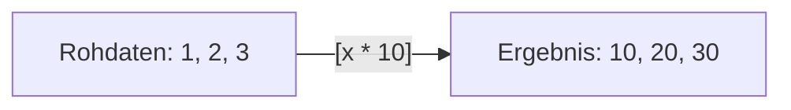

# 🐍 30-Tage Python Kurs - Woche 2: Datenstrukturen & Dateien

## 📖 Über Woche 2

**Was du diese Woche lernst:**
Fortgeschrittene Datenstrukturen und wie man mit Dateien arbeitet!

**Themen:**
- ✅ Tag 8: Dictionaries (Kontaktverwaltung)
- ✅ Tag 9: Tupel & Sets (Lotto-Generator)
- ✅ Tag 10: List Comprehensions (Datenfilter)
- ✅ Tag 11: Dateien lesen (Textdatei-Analyzer)
- ✅ Tag 12: Dateien schreiben (Notiz-App)
- ✅ Tag 13: Error Handling (Robuster Datei-Reader)
- ✅ Tag 14: Module & Imports (Eigenes Tool-Modul)

**Zeitaufwand:** 7 Tage × 5-15 Minuten = ca. 1-2 Stunden gesamt

---

## Tag 8: Kontaktverwaltung mit Dictionaries

### 📝 Aufgabe
Baue ein digitales Telefonbuch, das Namen, Nummern und E-Mails speichert.

---

### 📍 Schritt 1: Das mentale Modell (Der Aktenschrank)

**🎯 Ziel:** Verstehen, warum Listen nicht immer reichen.

**💡 Warum:** 
Stell dir vor, du hast eine Liste: `["Max", 25, "Berlin"]`.
Was bedeutet die `25`? Das Alter? Die Hausnummer? Die Schuhgröße?
Bei Listen musst du dir merken: "Index 1 ist das Alter". Das ist anstrengend.

Ein **Dictionary** ist wie ein Aktenschrank mit **Beschriftungen (Keys)**.
Du suchst nicht in "Schublade 2", sondern in der Schublade "Alter".

**🧠 Visueller Vergleich:**
```mermaid
graph LR
    subgraph Liste
    L[0: "Max"] --- L2[1: 25]
    end
    subgraph Dictionary
    K1["Key: 'name'"] --- V1["Value: 'Max'"]
    K2["Key: 'alter'"] --- V2["Value: 25"]
    end
    style K1 fill:#fff3e0
    style K2 fill:#fff3e0
```

**💻 Code:**
```python
# 1. Die alte Welt (Listen)
person_liste = ["Max Mustermann", 25, "Berlin"]
print(person_liste[1])  # Was war nochmal [1]? Ah, Alter.

# 2. Die neue Welt (Dictionaries)
# Syntax: { KEY : VALUE }
person = {
    "name": "Max Mustermann",
    "alter": 25,
    "stadt": "Berlin"
}

# Zugriff über den NAMEN (Key), nicht über eine Nummer!
print(person["name"])
print(person["stadt"])
```

**✅ Checkpoint:**
- Dictionaries benutzen geschweifte Klammern `{}`.
- Jeder Eintrag braucht einen Schlüssel (`Key`) und einen Wert (`Value`).

---

### 📍 Schritt 2: Der "KeyError" und der Sicherheitsgurt (.get)

**🎯 Ziel:** Sicher auf Daten zugreifen.

**💡 Warum:** Wenn du in einer Liste `liste[100]` abfragst, gibt es einen Fehler. Beim Dictionary ist es genauso: Wenn du einen Key suchst, den es nicht gibt, stürzt das Programm ab (`KeyError`).

**💻 Code:**
```python
kontakt = {
    "name": "Lisa",
    "telefon": "0176-12345678"
}

# 1. Der harte Weg (Crash möglich!)
# print(kontakt["email"])  # CRASH! KeyError: 'email'

# 2. Der sichere Weg (.get)
# "Versuche 'email' zu holen. Wenn nicht da, gib mir 'Keine Angabe'."
email = kontakt.get("email", "Keine Angabe") 
print(f"Email: {email}")

# 3. Hinzufügen & Ändern
kontakt["email"] = "lisa@test.de"  # Hinzufügen
kontakt["name"] = "Lisa Müller"    # Ändern

print(kontakt)
```

**✅ Checkpoint:**
Nutze immer `.get()`, wenn du nicht 100% sicher bist, ob der Key existiert!

---

### 📍 Schritt 3: Das Telefonbuch (Liste von Dictionaries)

**🎯 Ziel:** Mehrere Kontakte verwalten.

**💡 Warum:** Ein Kontakt ist ein Dictionary. Ein Telefonbuch ist eine **Liste** von Kontakten. Das ist die Standard-Struktur aller modernen Daten (JSON, APIs)!

**💻 Code:**
```python
telefonbuch = [
    {"name": "Alice", "nummer": "110"},
    {"name": "Bob", "nummer": "112"},
    {"name": "Charlie", "nummer": "911"}
]

# Zugriff auf Bob (Index 1) und seine Nummer (Key "nummer")
bobs_nummer = telefonbuch[1]["nummer"]
print(f"Bobs Nummer: {bobs_nummer}")

# Iterieren (Durchblättern)
print("\n--- Alle Kontakte ---")
for kontakt in telefonbuch:
    # 'kontakt' ist jedes Mal ein ganzes Dictionary!
    print(f"Name: {kontakt['name']}, Tel: {kontakt['nummer']}")
```

**✅ Checkpoint:**
- Die äußere Klammer ist `[]` (Liste - Ordnung ist wichtig).
- Die inneren Klammern sind `{}` (Dictionaries - Struktur ist wichtig).

---

### 📍 Schritt 4: Die App entwickeln

**🎯 Ziel:** Ein Programm, das Kontakte hinzufügt und sucht.

**📝 Anleitung:**
1.  Starte mit einer leeren Liste.
2.  Baue eine Schleife (Endlos).
3.  Frage den Nutzer nach Aktion (Neu / Suchen / Ende).

**💻 Code:**
```python
buch = []  # Leeres Telefonbuch

while True:
    print("\n1: Neuer Kontakt | 2: Suchen | 3: Ende")
    wahl = input("Auswahl: ")

    if wahl == "1":
        # Neuen Kontakt basteln
        n = input("Name: ")
        t = input("Telefon: ")
        # Als Dictionary verpacken
        neuer_eintrag = {"name": n, "tel": t}
        # Ins Buch (Liste) stecken
        buch.append(neuer_eintrag)
        print("✅ Gespeichert!")

    elif wahl == "2":
        suchwort = input("Wen suchst du? ")
        gefunden = False
        for eintrag in buch:
            if suchwort in eintrag["name"]:
                print(f"📞 Gefunden: {eintrag['tel']}")
                gefunden = True
        
        if not gefunden:
            print("❌ Niemanden gefunden.")

    elif wahl == "3":
        print("Bye!")
        break
```

**✅ Checkpoint:**
Teste die App: Füge zwei Leute hinzu und suche nach einem.

---

### 📍 Schritt 5: Challenge Time!

**Level 1: Die Visitenkarte**
Erstelle ein Dictionary `ich` mit `name`, `alter`, `hobbies` (als Liste!). Printe dein zweites Hobby.

**Level 2: Der Zähler**
Du hast einen Text: "fischers fritz fischt frische fische".
Benutze ein Dictionary, um zu zählen, wie oft jeder Buchstabe vorkommt.
Tipp: Key = Buchstabe, Value = Anzahl.

**Level 3: Das Inventar**
Du programmierst ein RPG. Dein Inventar ist ein Dictionary: `{"Heiltrank": 5, "Schwert": 1}`.
Der Spieler findet 2 Heiltränke. Update das Dictionary sicher (Tipp: Erst prüfen, ob Key da ist, oder `.get()` nutzen).

---

### 📚 Was du gelernt hast:

- ✅ **Dictionary:** `{Key: Value}` für Daten mit Namen.
- ✅ **KeyError:** Der Feind, den wir mit `.get()` besiegen.
- ✅ **Nesting:** Dictionaries in Listen (die Basis des Internets!).
- ✅ **Datenmodellierung:** Wie man echte Objekte (Kontakte) in Code abbildet.

## Tag 9: Lotto-Zahlen (Tupel & Sets)

### 📝 Aufgabe
Programmiere eine Lotto-Maschine, die garantiert keine doppelten Zahlen zieht.

---

### 📍 Schritt 1: Das mentale Modell (Tupel = Steinplatte)

**🎯 Ziel:** Verstehen, warum manche Daten "fest" sein müssen.

**💡 Warum:** 
Eine Liste `[52.5, 13.4]` kann man ändern. Man könnte versehentlich den Breitengrad von Berlin löschen.
Ein **Tupel** `(52.5, 13.4)` ist wie eine **in Stein gemeißelte Tafel**. Man kann sie lesen, aber nicht ändern.

**💻 Code:**
```python
# 1. Erstellen (Runde Klammern)
koordinaten = (52.52, 13.40)

# 2. Lesen (Wie Liste)
print(koordinaten[0]) 

# 3. Versuch zu ändern (Crash!)
# koordinaten[0] = 99.0  # TypeError! Geht nicht.

# 4. Unpacking (Der Profi-Trick)
# Wir packen das Tupel direkt in Variablen aus
breitengrad, laengengrad = koordinaten
print(f"Breite: {breitengrad}")
```

**✅ Checkpoint:**
Benutze Tupel für Dinge, die zusammengehören und sich nicht ändern (Datum, Koordinaten, RGB-Farben).

---

### 📍 Schritt 2: Das mentale Modell (Set = Der Türsteher)

**🎯 Ziel:** Doppelte Daten vermeiden.

**💡 Warum:** 
In einer Liste dürfen Werte doppelt sein: `[1, 2, 2, 3]`.
Ein **Set** ist wie ein exklusiver Club. Der Türsteher sagt: "Du bist schon drin, du kommst nicht nochmal rein."
Sets sind **ungeordnet** (wie ein Sack Murmeln, keine Reihenfolge).

**💻 Code:**
```python
# Liste mit Duplikaten
meine_liste = [1, 1, 2, 2, 3, 3, 3]

# Verwandlung in ein Set (Duplikate verschwinden!)
mein_set = set(meine_liste)
print(mein_set)  # {1, 2, 3}

# Direktes Erstellen (Geschweifte Klammern wie Dict, aber nur Werte)
farben = {"Rot", "Grün", "Blau", "Rot"}
print(farben)    # "Rot" ist nur einmal da!

# Achtung: Keine Indexierung!
# print(farben[0]) # CRASH! Sets haben keine Ordnung/Index.
```

**✅ Checkpoint:**
`set()` ist der schnellste Weg, Duplikate aus einer Liste zu löschen.

---

### 📍 Schritt 3: Mengenlehre (Die Magie)

**🎯 Ziel:** Prüfen, was zwei Gruppen gemeinsam haben.

**🧠 Visuell:** Denk an zwei Kreise, die sich überlappen (Venn-Diagramm).

**💻 Code:**
```python
freunde_mario = {"Anna", "Ben", "Chris"}
freunde_luigi = {"Ben", "Chris", "Dora"}

# 1. Wer kennt BEIDE? (Schnittmenge / Intersection) '&'
gemeinsame = freunde_mario & freunde_luigi
print(f"Kennen beide: {gemeinsame}") # {'Ben', 'Chris'}

# 2. Wer kennt NUR Mario? (Differenz) '-'
nur_mario = freunde_mario - freunde_luigi
print(f"Kennt nur Mario: {nur_mario}") # {'Anna'}

# 3. Alle zusammen (Vereinigung / Union) '|'
alle = freunde_mario | freunde_luigi
print(f"Alle Freunde: {alle}") # Anna, Ben, Chris, Dora (Ben/Chris nur 1x)
```

**✅ Checkpoint:**
Diese Operationen sind extrem schnell und nützlich für Vergleiche.

---

### 📍 Schritt 4: Der Lotto-Generator

**🎯 Ziel:** 6 Zufallszahlen ziehen - OHNE doppelte!

**📝 Anleitung:**
Wir nutzen ein Set, weil das Set automatisch verhindert, dass wir zweimal die gleiche Zahl ziehen.

**💻 Code:**
```python
import random

def ziehung_simulieren():
    trommel = set()  # Leeres Set

    # Solange wir noch keine 6 Zahlen haben...
    while len(trommel) < 6:
        kugel = random.randint(1, 49)
        trommel.add(kugel) # Set nimmt sie nur auf, wenn sie NEU ist
    
    # Sortieren für die Anzeige (gibt eine LISTE zurück)
    return sorted(trommel) 

def gewinn_check(dein_tipp, ziehung):
    # Wir wandeln alles in Sets um, um zu vergleichen
    set_tipp = set(dein_tipp)
    set_ziehung = set(ziehung)
    
    # Schnittmenge = Richtige
    richtige = set_tipp & set_ziehung
    zahl_richtige = len(richtige)
    
    return zahl_richtige, richtige

# --- Hauptprogramm ---
print("🎰 LOTTO 6 aus 49")
print("-" * 30)

mein_tipp = {1, 7, 13, 22, 30, 45}  # Direkt ein Set
print(f"Dein Tipp:      {sorted(mein_tipp)}")

gezogen = ziehung_simulieren()
print(f"Gezogene Zahlen:{gezogen}")

anzahl, treffer = gewinn_check(mein_tipp, gezogen)
print("-" * 30)
print(f"Du hast {anzahl} Richtige!")
if anzahl > 0:
    print(f"Treffer: {treffer}")
```

**✅ Checkpoint:**
Lass das Programm mehrmals laufen. Du wirst sehen, dass `gezogen` nie doppelte Zahlen enthält.

---

### 📍 Schritt 5: Challenge Time!

**Level 1: Der Zutritts-Check**
Erstelle ein Tuple `erlaubte_extensions = (".jpg", ".png", ".gif")`.
Prüfe ob eine Datei "bild.pdf" erlaubt ist (Tipp: `endswith`).

**Level 2: Doppelte Wörter finden**
Nimm den Satz: "Das ist das Haus vom Nikolaus".
Finde heraus, wie viele *einzigartige* Wörter er hat (Achtung auf Groß/Klien-Schreibung!).

**Level 3: Dating App**
Du hast zwei Sets mit Hobbies von Person A und B.
Berechne den "Match-Score" (Anzahl gemeinsame Hobbies / Anzahl alle Hobbies * 100).

---

### 📚 Was du gelernt hast:

- ✅ **Tupel `()`:** Datentresore, die man nicht ändern kann.
- ✅ **Sets `{}`:** Bodyguards, die keine Duplikate reinlassen.
- ✅ **Unpacking:** `x, y = punkt` (Elegant!).
- ✅ **Schnittmenge `&`:** Das mächtigste Werkzeug für Vergleiche.

## Tag 10: Datenfilter mit List Comprehensions

### 📝 Aufgabe
Lerne die Python-Superkraft: Listen in einer Zeile filtern und verwandeln.

---

### 📍 Schritt 1: Das mentale Modell (Der Zauberspruch)

**🎯 Ziel:** Verstehen, warum wir "List Comprehensions" benutzen.

**💡 Warum:** 
Normalerweise sagst du dem Computer Schritt-für-Schritt, was er tun soll (wie einem Kleinkind):
"Nimm Zahl 1. Verdopple sie. Leg sie ab. Nimm Zahl 2..."

Mit **List Comprehensions** gibst du einen **Befehl** (wie einem Armee-General):
"Verdopple ALLE Zahlen!"

**🧠 Visueller Vergleich:**


**💻 Code:**
```python
zahlen = [1, 2, 3, 4, 5]

# 1. Der "langsame" Weg (Imperativ)
ergebnis = []
for z in zahlen:
    ergebnis.append(z * 2)
print(ergebnis)

# 2. Der Python-Weg (Deklarativ)
# Lies es so: "Nimm z mal 2 FÜR JEDES z IN zahlen"
schnell = [z * 2 for z in zahlen]
print(schnell)
```

**✅ Checkpoint:**
Die Syntax ist immer: `[ WAS_TUN for VARIABLE in LISTE ]`.

---

### 📍 Schritt 2: Transformer (Mapping)

**🎯 Ziel:** Daten umwandeln.

**💡 Warum:** Du hast Rohdaten (z.B. Preise ohne Steuer, Namen klein geschrieben) und willst eine bereinigte Liste.

**💻 Code:**
```python
namen = ["max", "moritz", "leia"]

# Aufgabe: Alle Namen sollen mit Großbuchstaben anfangen
# Wir wenden .capitalize() auf JEDEN Namen an
sauber = [n.capitalize() for n in namen]

print(f"Vorher: {namen}")
print(f"Nachher: {sauber}")

# Preise formatieren
preise = [10, 20, 99]
schilder = [f"{p} €" for p in preise]
print(schilder) # ['10 €', '20 €', '99 €']
```

**✅ Checkpoint:**
Du sparst dir `ergebnis_liste = []` und `append()`. Das macht den Code viel lesbarer.

---

### 📍 Schritt 3: Der Filter (Selection)

**🎯 Ziel:** Nur bestimmte Daten behalten.

**💡 Warum:** Du willst aus 1000 Werten nur die positiven, oder nur die User, die "aktiv" sind.
Dafür hängen wir ein `if` hinten an.

**💻 Code:**
```python
temperaturen = [20, 22, -5, 18, -1, 30]

# "Gib mir t FÜR JEDES t IN temperaturen WENN t größer 0 ist"
sommer = [t for t in temperaturen if t > 0]
print(f"Warm genug: {sommer}")

# Nur gerade Zahlen
zahlen = [1, 2, 3, 4, 5, 6]
gerade = [z for z in zahlen if z % 2 == 0]
print(f"Gerade: {gerade}")
```

**✅ Checkpoint:**
Die Syntax erweitert sich: `[ WAS_TUN for VAR in LISTE if BEDINGUNG ]`.

---

### 📍 Schritt 4: Die ultimative Daten-Pipeline

**🎯 Ziel:** Verwandeln UND Filtern gleichzeitig.

**📝 Anleitung:**
Wir haben eine Liste von rohen E-Mail-Eingaben. Manche sind ungültig (kein @), manche sind klein geschrieben, manche haben Leerzeichen.
Wir wollen eine saubere Liste.

**💻 Code:**
```python
raw_emails = ["  max@test.de ", "KEIN_EMAIL", "  anna@web.de", "Falsch"]

# Schritt für Schritt in EINER Zeile:
# 1. n.strip().lower() -> Leerzeichen weg, kleinschreiben
# 2. if "@" in n -> Nur Strings mit @ behalten

clean_emails = [e.strip().lower() for e in raw_emails if "@" in e]

print("Rohdaten:", raw_emails)
print("Sauber:", clean_emails)
```

**✅ Checkpoint:**
Das ist Profi-Code! Effizient und (wenn man es einmal verstanden hat) sehr klar.

---

### 📍 Schritt 5: Challenge Time!

**Level 1: Kurznamen**
Liste: `["Alexander", "Jan", "Katherina", "Bo"]`.
Erstelle eine Liste, die nur Namen mit weniger als 4 Buchstaben enthält.

**Level 2: Preise mit Rabatt**
Liste: `[100, 50, 200, 30]`.
Erstelle eine neue Liste, wo jeder Preis halbiert ist, ABER nur wenn der ursprüngliche Preis über 50 war.

**Level 3: Vokale entfernen**
Text: `"Hallo Python Welt"`.
Erstelle eine Liste aller Buchstaben des Textes, aber OHNE Vokale (a, e, i, o, u).
Tipp: Strings sind auch Listen von Buchstaben!

---

### 📚 Was du gelernt hast:

- ✅ **List Comprehensions:** Listen in einer Zeile erstellen.
- ✅ **Mapping:** Daten verändern `[x*2 for x in ...]`.
- ✅ **Filtering:** Daten auswählen `[... if x > 5]`.
- ✅ **Clean Code:** Kürzerer Code ist oft (nicht immer) besserer Code.

## Tag 11: Textdatei-Analyzer (Dateien Lesen)

### 📝 Aufgabe
Baue ein Tool, das Texte aus Dateien liest und analysiert.

---

### 📍 Schritt 0: Vorbereitung (Daten erzeugen)

**🎯 Ziel:** Sicherstellen, dass wir eine Datei zum Lesen haben.

**💻 Code:**
```python
# Führe das EINMAL aus, damit die Datei existiert
text = """Erstes Log
Fehler am Mittwoch
Warnung am Freitag
Fehler am Sonntag
Erfolg am Montag"""

with open("test_log.txt", "w", encoding="utf-8") as f:
    f.write(text)

print("✅ Datei 'test_log.txt' wurde erstellt!")
```

---

### 📍 Schritt 1: Das mentale Modell (Die automatische Tür)

**🎯 Ziel:** Verstehen, warum wir `with open(...)` benutzen.

**💡 Warum:** 
Dateien sind wie Kühlschranktüren. 
Wenn du `open()` machst, geht die Tür auf.
Wenn du vergisst, sie zu schließen (`close()`), geht das Licht kaputt (Datenfehler/Absturz).

Der `with`-Block ist eine **Tür mit Automatik-Schließer**. Egal was passiert (auch bei Fehlern!), die Tür wird am Ende ZUGEKNALLT.

**💻 Code:**
```python
# RICHTIG:
with open("test_log.txt", "r", encoding="utf-8") as datei:
    # Solange wir hier eingerückt sind, ist die Datei offen
    inhalt = datei.read()
    print(inhalt)

# Hier ist die Datei automatisch ZU.
# print(datei.read()) # FEHLER! Datei ist zu.
```

**✅ Checkpoint:**
Benutze NIEMALS `open()` ohne `with`. Es ist den Ärger nicht wert.

---

### 📍 Schritt 2: Der Staubsauger (Alles lesen)

**🎯 Ziel:** Den ganzen Inhalt in eine Variable laden.

**💡 Warum:** Einfach, aber gefährlich bei riesigen Dateien (RAM voll!).

**💻 Code:**
```python
with open("test_log.txt", "r", encoding="utf-8") as f:
    alles = f.read()  # Saugt ALLES in einen String
    
print(f"Die Datei hat {len(alles)} Zeichen.")
print("-" * 20)
print(alles[:20]) # Zeige nur die ersten 20 Zeichen
```

**✅ Checkpoint:**
`encoding="utf-8"` ist Pflicht für Umlaute und Emojis!

---

### 📍 Schritt 3: Der Scanner (Zeile für Zeile)

**🎯 Ziel:** Große Dateien Speicher-effizient verarbeiten.

**💡 Warum:** Wenn eine Datei 10 GB groß ist, kannst du sie nicht mit `.read()` laden. Aber du kannst sie Zeile für Zeile lesen!

**💻 Code:**
```python
print("🔍 Suche nach FEHLERN:")

with open("test_log.txt", "r", encoding="utf-8") as f:
    # Die Datei 'f' verhält sich wie eine Liste von Zeilen
    for zeile in f:
        zeile_sauber = zeile.strip() # \n (Umbruch) am Ende entfernen
        
        if "Fehler" in zeile_sauber:
            print(f"ALARMIERT: {zeile_sauber}")
```

**✅ Checkpoint:**
Das ist der Profi-Weg. Er verbraucht fast keinen Arbeitsspeicher, egal wie groß die Datei ist.

---

### 📍 Schritt 4: Die Analyse-Maschine

**🎯 Ziel:** Eine Statistik erstellen.

**💻 Code:**
```python
statistik = {"Fehler": 0, "Warnung": 0, "Erfolg": 0}

with open("test_log.txt", "r", encoding="utf-8") as f:
    for zeile in f:
        if "Fehler" in zeile:
            statistik["Fehler"] += 1
        elif "Warnung" in zeile:
            statistik["Warnung"] += 1
        elif "Erfolg" in zeile:
            statistik["Erfolg"] += 1

print("📊 LOG-ANALYSE:")
print(statistik)
```

**✅ Checkpoint:**
Wir kombinieren Datei-Iteration mit Dictionaries (Tag 8).

---

### 📍 Schritt 5: Challenge Time!

**Level 1: Zeilennummern**
Lies `test_log.txt` und gib jede Zeile mit Nummer aus: `1: Erstes Log`, `2: Fehler...` (Tipp: `enumerate`).

**Level 2: Rückwärts**
Lies die Datei ein und gib sie *rückwärts* aus (letzte Zeile zuerst).

**Level 3: Der Suchen-Ersetzer**
Lade den Text, ersetze "Fehler" durch "Problem" und gib den neuen Text aus (nur im Speicher, nicht in Datei speichern).

---

### 📚 Was du gelernt hast:

- ✅ **`with open(...)`:** Der sichere Weg, Dateien zu öffnen.
- ✅ **`.read()`:** Alles auf einmal (Vorsicht Speicher!).
- ✅ **`for line in f`:** Effizientes Zeilen-Lesen.
- ✅ **`encoding="utf-8"`:** Damit ä, ö, ü funktionieren.

## Tag 12: Notiz-App (Dateien Schreiben)

### 📝 Aufgabe
Entwickle eine App, die sich Dinge merken kann, auch wenn du den Computer ausschaltest.

---

### 📍 Schritt 1: Das mentale Modell (Der Schreiber)

**🎯 Ziel:** Den Unterschied zwischen `w` (Write) und `a` (Append) verstehen.

**💡 Warum:** 
`w` ist aggressiv: Es löscht den alten Inhalt SOFORT. Wie eine Tafel wischen.
`a` ist sanft: Es hängt Neues hinten an. Wie ein Tagebuch fortführen.

**💻 Code:**
```python
# DAS EXPERIMENT

# 1. Wir schreiben etwas (w)
with open("tagebuch.txt", "w", encoding="utf-8") as f:
    f.write("Tag 1: Ich habe Python gelernt.\n")

# 2. Wir nutzen wieder 'w' (ACHTUNG!)
with open("tagebuch.txt", "w", encoding="utf-8") as f:
    f.write("Tag 2: Alles ist weg!\n")

# -- Datei prüfen --
with open("tagebuch.txt", "r", encoding="utf-8") as f:
    print(f"Inhalt nach 'w':\n{f.read()}")

# 3. Wir nutzen 'a' (Append)
with open("tagebuch.txt", "a", encoding="utf-8") as f:
    f.write("Tag 3: Das hier bleibt.\n")

# -- Datei prüfen --
with open("tagebuch.txt", "r", encoding="utf-8") as f:
    print(f"Inhalt nach 'a':\n{f.read()}")
```

**✅ Checkpoint:**
Nutze `w` nur, wenn du **neu anfangen** willst. Nutze `a` für Logs oder Listen.

---

### 📍 Schritt 2: Strukturierte Daten (JSON)

**🎯 Ziel:** Listen und Dictionaries speichern.

**💡 Warum:** Du kannst eine Liste ["Apfel", "Banane"] nicht einfach mit f.write() speichern (das erwartet String).
Wir nutzen **JSON** (JavaScript Object Notation) - das Standardformat im Web.

**💻 Code:**
```python
import json

daten = {
    "highscore": 9999,
    "benutzer": "Mario",
    "items": ["Pilz", "Blume", "Stern"],
    "level_beendet": True
}

# SPEICHERN (Dump)
with open("spielstand.json", "w", encoding="utf-8") as f:
    json.dump(daten, f, indent=4) # indent=4 macht es schön lesbar

print("✅ Spielstand gespeichert!")

# LADEN (Load)
with open("spielstand.json", "r", encoding="utf-8") as f:
    geladen = json.load(f)

print(f"Geladener Highscore: {geladen['highscore']}")
print(f"Items: {geladen['items']}")
```

**✅ Checkpoint:**
json.dump() speichert, json.load() lädt. Es verwandelt Python-Objekte automatisch in Text und zurück!

---

### 📍 Schritt 3: Die To-Do App (Projekt)

**🎯 Ziel:** Eine echte Anwendung bauen.

**📝 Anleitung:**
Wir brauchen:
1.  Eine laden() Funktion.
2.  Eine speichern() Funktion.
3.  Eine Schleife für User-Input.

**💻 Code:**
```python
import json
import os

DATEI = "todos.json"

def lade_todos():
    if not os.path.exists(DATEI):
        return [] # Leere Liste wenn Datei fehlt
    with open(DATEI, "r", encoding="utf-8") as f:
        return json.load(f)

def speichere_todos(todos):
    with open(DATEI, "w", encoding="utf-8") as f:
        json.dump(todos, f, indent=4)

# Hauptprogramm
todos = lade_todos()
print(f"📅 Willkommen! Du hast {len(todos)} Aufgaben.")

while True:
    print("\n1. Anzeigen | 2. Hinzufügen | 3. Löschen | 4. Ende")
    wahl = input("Auswahl: ")
    
    if wahl == "1":
        for i, todo in enumerate(todos, 1):
            status = "[x]" if todo['erledigt'] else "[ ]"
            print(f"{i}. {status} {todo['text']}")
            
    elif wahl == "2":
        text = input("Aufgabe: ")
        todos.append({"text": text, "erledigt": False})
        speichere_todos(todos) # Sofort speichern!
        print("✅ Gespeichert.")
        
    elif wahl == "3":
        nummer = int(input("Nummer löschen: "))
        if 0 < nummer <= len(todos):
            geloescht = todos.pop(nummer - 1)
            speichere_todos(todos)
            print(f"🗑️ '{geloescht['text']}' gelöscht.")
            
    elif wahl == "4":
        print("👋 Bye!")
        break
```

**✅ Checkpoint:**
Starte das Programm, füge etwas hinzu, beende es. Starte es NEU. Deine Daten sind noch da! Das ist **Persistenz**.

---

### 📍 Schritt 4: Challenge Time!

**Level 1: Erledigen**
Füge Option "5. Erledigen" hinzu. Der User gibt eine Nummer ein, und der Status ändert sich von False auf True ([x]).

**Level 2: Highscore-Liste**
Schreibe ein kleines Zahlen-Ratespiel (aus Tag 6), das den Highscore (wenigste Versuche) in highscore.txt speichert. Beim Start soll der aktuelle Rekord angezeigt werden.

**Level 3: Das Logbuch**
Erstelle logger.py. Jedes Mal wenn du es ausführst (python logger.py "Hallo"), soll es Datum + Uhrzeit + Nachricht in logbuch.txt ANHÄNGEN.

---

### 📚 Was du gelernt hast:

- ✅ **`w` vs `a`:** Überschreiben vs Anhängen.
- ✅ **JSON:** Der Goldstandard für Daten-Speicherung.
- ✅ **Persistenz:** Daten überleben den Programm-Absturz.
- ✅ **`os.path.exists`:** Prüfen bevor man lädt.

---

## Tag 13: Robuster Code (Error Handling)

### 📝 Aufgabe
Mache deine Programme unzerstörbar. Lerne, wie du Fehler abfängst, bevor sie zum Absturz führen.

---

### 📍 Schritt 1: Das mentale Modell (Das Sicherheitsnetz)

**🎯 Ziel:** Verstehen, warum Programme abstürzen und wie man es verhindert.

**💡 Warum:** 
Normaler Code ist wie ein Seiltänzer ohne Netz. Ein Stolperer (z.B. eine falsche Benutzereingabe) und das Programm stürzt ab.
**Error Handling** ist das Sicherheitsnetz. Wenn der Tänzer fällt, wird er aufgefangen und kann weitergehen.

**💻 Code:**
```python
# DAS EXPERIMENT: Was passiert beim Absturz?
# zahl = int(input("Gib eine Zahl ein: ")) # Wenn ich "hallo" tippe -> CRASH!

# DIE RETTUNG: try-except
try:
    eingabe = input("Gib eine Zahl ein: ")
    zahl = int(eingabe)
    print(f"Super! Deine Zahl ist {zahl}")
except ValueError:
    # Das hier passiert NUR, wenn oben ein ValueError auftritt
    print("❌ Ups! Das war keine Zahl. Bitte probier es nochmal.")

print("Programm läuft sicher weiter...")
```

**✅ Checkpoint:**
Der Code im `try`-Block wird "ausprobiert". Wenn ein Fehler passiert, springt Python sofort in den `except`-Block.

---

### 📍 Schritt 2: Spezifische Fangnetze

**🎯 Ziel:** Verschiedene Fehler unterschiedlich behandeln.

**💡 Warum:** Eine Division durch Null ist ein anderes Problem als eine fehlende Datei. Wir wollen genau wissen, was schiefgelaufen ist.

**💻 Code:**
```python
def teile_zahlen():
    try:
        a = float(input("Zahl 1: "))
        b = float(input("Zahl 2: "))
        ergebnis = a / b
        print(f"Ergebnis: {ergebnis}")
    except ValueError:
        print("❌ Bitte nur Zahlen eingeben!")
    except ZeroDivisionError:
        print("❌ Du kannst nicht durch Null teilen!")
    except Exception as e:
        # Der "Joker": Fängt alles andere ab
        print(f"❓ Unerwarteter Fehler: {e}")

teile_zahlen()
```

**✅ Checkpoint:**
Man kann beliebig viele `except`-Blöcke untereinander schreiben. Python nimmt den ersten, der passt.

---

### 📍 Schritt 3: Aufräumen mit `finally`

**🎯 Ziel:** Sicherstellen, dass Code IMMER ausgeführt wird.

**💡 Warum:** Wenn du eine Datei öffnest, musst du sie schließen – egal ob ein Fehler passiert ist oder nicht. `finally` ist die Aufräum-Kolonne.

**💻 Code:**
```python
try:
    f = open("geheim.txt", "w")
    f.write("Das ist ein Test.")
    # Stell dir vor, hier passiert ein Fehler...
    x = 1 / 0
except ZeroDivisionError:
    print("Fehler berechnet!")
finally:
    f.close()
    print("🧹 Datei wurde sicher geschlossen.")
```

**✅ Checkpoint:**
Der `finally`-Block läuft **immer**, egal ob ein Fehler passiert ist, abgefangen wurde oder das Programm glatt lief.

---

### 📍 Schritt 4: Alarm schlagen (`raise`)

**🎯 Ziel:** Eigene Fehler auslösen.

**💡 Warum:** Manchmal ist für Python alles okay, aber für deine App nicht (z.B. ein Alter von -5 Jahren). Dann kannst du selbst einen Fehler "werfen".

**💻 Code:**
```python
def setze_alter(alter):
    if alter < 0:
        # Wir lösen manuell einen Fehler aus
        raise ValueError("Alter kann nicht negativ sein!")
    print(f"Alter gesetzt auf {alter}")

try:
    setze_alter(-10)
except ValueError as e:
    print(f"🚫 Fehler im Programm: {e}")
```

**✅ Checkpoint:**
Mit `raise` signalisierst du: "Stopp! Hier stimmt etwas logisch nicht."

---

### 📍 Schritt 5: Challenge Time!

**Level 1: Der Robuste Rechner**
Schreibe eine Endlosschleife, die zwei Zahlen addiert. Fange `ValueError` ab, falls der User keine Zahl eingibt, damit das Programm nicht beendet wird.

**Level 2: Datei-Check**
Frage den User nach einem Dateinamen. Versuche die Datei zu öffnen und den Inhalt anzuzeigen. Fange den `FileNotFoundError` ab und gib eine freundliche Meldung aus.

**Level 3: Eigene Validierung**
Schreibe eine Funktion `check_passwort(pw)`. Wenn das Passwort kürzer als 8 Zeichen ist, löse einen `ValueError` mit einer passenden Nachricht aus.

---

### 📚 Was du gelernt hast:

- ✅ **try-except:** Das Sicherheitsnetz für deinen Code.
- ✅ **Spezifische Errors:** Gezielte Hilfe für den User (ValueError, ZeroDivisionError).
- ✅ **finally:** Der Aufräum-Meister.
- ✅ **raise:** Selbst die Kontrolle über Fehler übernehmen.
- ✅ **Stabilität:** Programme schreiben, die niemals crashen.

---

## Tag 14: Der Werkzeugkasten (Module & Imports)

### 📝 Aufgabe
Höre auf, alles selbst zu schreiben! Lerne, wie du fertige Bausteine nutzt und deinen Code in eigene "Werkzeuge" aufteilst.

---

### 📍 Schritt 1: Das mentale Modell (Der LEGO-Baukasten)

**🎯 Ziel:** Verstehen, was Module sind.

**💡 Warum:** 
Stell dir vor, du müsstest für jedes LEGO-Haus die Plastiksteine erst selbst gießen. Unmöglich! 
In Python sind **Module** fertige Boxen mit Steinen (Funktionen & Klassen). 
Ein Profi nutzt, was schon da ist, und baut nur die speziellen Teile selbst.

**💻 Code:**
```python
# Die Werkzeugkiste öffnen (Standard Library)
import random
import math
import time

# Ein fertiges Werkzeug nutzen
print("🎲 Würfeln...", end="", flush=True)
time.sleep(1) # Kurze Pause
ergebnis = random.randint(1, 6)
print(f" {ergebnis}!")

# Mathematische Profi-Werkzeuge
radius = 5
flaeche = math.pi * radius**2
print(f"⭕ Fläche des Kreises: {flaeche:.2f}")
```

**✅ Checkpoint:**
`import` lädt eine ganze Kiste voller Werkzeuge. Um ein Werkzeug zu nutzen, schreibst du `Kiste.Werkzeug`.

---

### 📍 Schritt 2: Gezielter Zugriff

**🎯 Ziel:** Nur das importieren, was man wirklich braucht.

**💡 Warum:** Wenn du nur einen Hammer brauchst, schleppst du nicht den ganzen Werkstatt-Schrank mit. Das spart Tipparbeit und macht den Code sauberer.

**💻 Code:**
```python
# Nur zwei Steine aus der Box holen
from math import sqrt, ceil

# Wir brauchen kein "math." mehr davor!
wurzel = sqrt(16)
aufgerundet = ceil(4.2)

print(f"Wurzel: {wurzel}, Aufgerundet: {aufgerundet}")

# Profi-Tipp: Eigenen Namen geben (Alias)
import datetime as dt
jetzt = dt.datetime.now()
print(f"📅 Datum: {jetzt}")
```

**✅ Checkpoint:**
`from Modul import Funktion` holt das Werkzeug direkt in deinen Code. Aber Vorsicht: Wenn du eine eigene Funktion mit dem gleichen Namen hast, gibt es Chaos!

---

### 📍 Schritt 3: Die eigene Werkstatt (Eigene Module)

**🎯 Ziel:** Code über mehrere Dateien verteilen.

**💡 Warum:** Wenn dein Programm 1000 Zeilen lang wird, verlierst du den Überblick. Du lagerst Funktionen in eigene Dateien aus.

**📝 Anleitung:**
1. Erstelle eine Datei `mein_werkzeug.py`.
2. Erstelle eine zweite Datei `hauptprogramm.py`.

**💻 Code:**
*Datei: `mein_werkzeug.py`*
```python
def sag_hallo(name):
    return f"Moin {name}! Wie läuft das Programmieren?"

def quadrat(zahl):
    return zahl * zahl
```

*Datei: `hauptprogramm.py`*
```python
import mein_werkzeug

print(mein_werkzeug.sag_hallo("Coder"))
print(f"Das Quadrat von 8 ist {mein_werkzeug.quadrat(8)}")
```

**✅ Checkpoint:**
Jede `.py` Datei in deinem Ordner ist automatisch ein Modul, das du importieren kannst.

---

### 📍 Schritt 4: Das Geheimnis von `__main__`

**🎯 Ziel:** Verhindern, dass Module von selbst losrollen.

**💡 Warum:** Wenn du ein Modul importierst, führt Python den Code darin aus. Wenn du dort Test-Prints hast, erscheinen die plötzlich in deinem Hauptprogramm. Das wollen wir verhindern.

**💻 Code:**
*Datei: `rechner.py`*
```python
def addiere(a, b):
    return a + b

# Dieser Block wird NUR ausgeführt, wenn du rechner.py DIREKT startest,
# aber NICHT, wenn du es importierst!
if __name__ == "__main__":
    print("--- Selbsttest des Rechners ---")
    print(f"Test: 2 + 2 = {addiere(2, 2)}")
```

**✅ Checkpoint:**
Nutze diesen "Zauber-Satz" immer, wenn du Test-Code in deinen Modulen behalten willst.

---

### 📍 Schritt 5: Challenge Time!

**Level 1: Zufalls-Menü**
Importiere random. Erstelle eine Liste mit 5 Gerichten. Importiere auch time. Gib eine Meldung aus "Der Chefkoch überlegt...", warte 2 Sekunden mit sleep(), und gib dann ein zufälliges Gericht aus.

**Level 2: Die Geometrie-Box**
Erstelle ein eigenes Modul geometrie.py mit Funktionen für den Umfang eines Kreises und die Fläche eines Quadrats. Importiere es in ein main.py und nutze die Funktionen.

**Level 3: Feiertags-Scanner**
Recherche online: Welches Modul nutzt man in Python, um das aktuelle Jahr auszugeben? Baue ein Programm, das prüft, wie viele Tage es noch bis zum 24. Dezember sind.

---

### 📚 Was du gelernt hast:

- ✅ **Standard-Lib:** Die riesige Schatzkiste von Python nutzen.
- ✅ **from / import:** Gezielter Zugriff auf Werkzeuge.
- ✅ **Module bauen:** Code modular und übersichtlich halten.
- ✅ **Abstraktion:** Funktionen in Dateien auslagern und wiederverwenden.
- ✅ **Standard-Muster:** Den professionellen Aufbau von Scripts (if __name__ == "__main__":).

---

